# Plan: Review-Gated Agent Workflow Open Source v1

Status: completed
Priority: high
Owner: codex/human
Scope: docs_only
Created: 2026-06-30
Last Updated: 2026-06-30

## Objective

Create a universal, open-source-ready Codex workflow design that turns explicit
PRD work into a review-gated pipeline:

1. explicit PRD workflow entry;
2. project-independent brainstorm;
3. reviewable HTML PRD/RPD artifact with diagrams;
4. human PRD review gate;
5. PLAN creation through plan-creator;
6. human PLAN review gate;
7. PLAN execution with phase status display;
8. scoped Group2 implementation and Group3 validation;
9. post-PLAN summarization and optional workflow evolution.

The output should be suitable for publishing as a GitHub repository in a
plugin-first format, while also documenting how teams can copy individual
skills, hooks, templates, or examples.

## Task Classification

Primary area: `docs_only`

Secondary areas:
- `task_substrate`
- `eval_policy_ops`
- `memory_feedback`

High-risk contracts:
- Existing research workflow contracts must not change.
- Existing EvidenceBundle, citation, source-quality, run-step, task-status, and
  public API response shapes are out of scope.
- Existing project-specific `invest_*` subagent rules must not be deleted or
  silently replaced during this PLAN.

## Background Reused

- `docs/prd/prd_reference_for_codex.md`
  - PRD must be usable for development, acceptance, and review.
  - PRD must include objective, non-goals, inputs/outputs, AI quality
    constraints, evidence/source requirements, acceptance criteria, risks, and
    open questions.
- `docs/subagents-operating-model.md`
  - Existing project explanation of the 6-role subagent system.
- `docs/agent-workflow-self-evolution-report.md`
  - Existing report for workflow, TDD, gates, and self-evolution.
- `.agent/skills/group2-worker-lane-design.md`
  - Existing project-bound Group2 lane design; must be generalized for the
    open-source workflow.
- `.agent/skills/subagent-gate-contract.md`
  - Existing separation between director, Group2 implementation, Group3 code
    quality, Group3 functional validation, and summarizer.
- `.agent/skills/tdd-policy.md`
  - Existing distinction among test-first, characterization tests, live evals,
    and manual governance dry-runs.
- `.agent/skills/real-world-case-design.md`
  - Existing Group3 ownership of practical validation cases.
- Official Codex manual, checked 2026-06-30:
  - Skills are reusable workflow authoring units.
  - Plugins are the preferred installable distribution unit for reusable
    workflows with skills, hooks, scripts, templates, or app/MCP config.
  - Hooks can be bundled through plugin lifecycle config or a default
    `hooks/hooks.json`.
- User decisions from 2026-06-30:
  - Phase icons are shown only during PLAN execution, not during PRD preflight.
  - Names and roles must be universal by default.
  - Project binding appears only in explicit `group2-design`.
  - `group2-design` requires multi-round human conversation.
  - PRD workflow must be explicit opt-in; Codex must not auto-enter PRD mode
    for everyday coding, testing, review, or explanation tasks.

## Scope

In scope:
- Design a universal workflow model and final GitHub repository shape.
- Define explicit trigger rules for PRD workflow and `group2-design`.
- Define the review gates before PRD approval, before PLAN execution, and after
  PLAN completion.
- Define universal Group1, Group2, and Group3 role names and responsibilities.
- Define a multi-round `group2-design` conversation protocol.
- Define hooks and scope guard design for each workflow stage.
- Define plugin-first open-source package layout.
- Define validation for docs, skills, hooks, templates, and example artifacts.
- Update existing project docs/skills/status to reflect this workflow only after
  the plan makes those edits explicit.

Out of scope:
- No production business logic changes.
- No source, provider, research workflow, EvidenceBundle, citation, task queue,
  or API response changes.
- No automatic migration of current `invest_*` roles unless a later phase
  explicitly creates a compatibility layer.
- No live provider evals unless a later implementation phase creates examples
  requiring them.
- No default PRD workflow invocation for ordinary Codex requests.

## Constraints

- The workflow must be universal and open-source-ready.
- The plugin must not assume this repository, this domain, or finance/research
  as the target project.
- The PRD workflow and `group2-design` must set
  `allow_implicit_invocation: false` or equivalent documentation, so they only
  run when explicitly invoked.
- Phase status icons apply only after PLAN execution starts.
- Human review gates are hard stops:
  - PRD review gate before PLAN creation.
  - PLAN review gate before PLAN execution.
  - Group2 design review gate before project-bound worker design is accepted.
- Group2 cannot modify PLAN/STATUS unless a specific governance phase assigns
  that as the work product.
- Group3 cannot silently repair production code while validating.
- Hooks should enforce scope by preflight permission checks and postflight diff
  audits, not by changing the user's workflow intent.
- Keep changes narrow and reversible.

## Architecture / Design Direction

The open-source workflow should use a plugin-first distribution model:

```text
review-gated-agent-workflow/
  README.md
  LICENSE
  CHANGELOG.md
  CONTRIBUTING.md
  docs/
  plugins/
    review-gated-agent-workflow/
      .codex-plugin/
        plugin.json
      skills/
      hooks/
      scripts/
      templates/
      assets/
  .agents/
    plugins/
      marketplace.json
  examples/
```

The core user-facing model separates pre-PLAN gates from PLAN execution phases:

```text
Gate A: explicit PRD workflow entry
Gate B: brainstorm
Gate C: HTML PRD/RPD generation
Gate D: human PRD review
Gate E: optional explicit group2-design
Gate F: plan-creator creates PLAN
Gate G: human PLAN review
Gate H: wait for explicit PLAN implementation command

PLAN execution:
phase 1: workflow-director plans and assigns work
phase 2: Group2 implements scoped work
phase 3: Group3 validates code quality and function
phase 4: workflow-summarizer evaluates outcome and evolution needs
```

Universal role names:

| Group | Role | Purpose |
|---|---|---|
| Group1 | `workflow-director` | Reads status and PLAN, refines validation, assigns workers, controls phase transitions. |
| Group1 | `workflow-summarizer` | Runs after done condition, evaluates outcome and whether roles/skills/hooks need updates. |
| Group2 | `architecture-builder` | Designs architecture, contracts, harnesses, scope boundaries, and migration strategy. |
| Group2 | `feature-implementer` | Implements concrete code, tools, scripts, API, or docs within assigned write scope. |
| Group3 | `code-quality-validator` | Runs lint, format, compile, tests, import checks, and scope audits. |
| Group3 | `functional-validator` | Validates real behavior against PLAN acceptance criteria and practical cases. |

`group2-design` is a universal skill that only becomes project-bound after
human-guided discovery. It must run as a multi-round conversation:

1. Round 1: identify project type, domain, architecture, risk boundaries, and
   existing team conventions.
2. Round 2: propose Group2 worker roles, ownership, and non-goals.
3. Round 3: define allowed write scopes, forbidden paths/contracts, sandbox
   posture, and escalation rules.
4. Round 4: define Group3 handoff, validation ownership, and TDD/live-eval
   expectations.
5. Round 5: human review, revisions, and final acceptance.

## Workflow Diagram

```mermaid
flowchart TD
    A[User request] --> B{Explicit PRD workflow invocation?}

    B -- No --> C[Normal Codex workflow]
    C --> C1[Read repo rules and active PLAN only when needed]
    C1 --> C2[Execute docs/code/test/review task]
    C2 --> C3[Update PLAN/STATUS only when task rules require it]
    C3 --> Z1[End]

    B -- Yes --> D[Gate A: PRD workflow entry]
    D --> D1[Confirm feature name, background, users, goals, non-goals]
    D1 --> E[Gate B: universal brainstorm]

    E --> E1[Problem framing]
    E --> E2[Solution candidates]
    E --> E3[Risks, boundaries, open questions]
    E1 --> F[Gate C: HTML PRD/RPD generation]
    E2 --> F
    E3 --> F

    F --> F1[Apply PRD template]
    F1 --> F2[Generate flow chart, risk matrix, acceptance table]
    F2 --> F3[Write reviewable PRD/RPD artifact]

    F3 --> G[Gate D: human PRD review]
    G --> H{Approved?}
    H -- No --> H1[Human feedback]
    H1 --> E

    H -- Yes --> I{Explicit need for group2-design?}
    I -- No --> L[Gate F: create PLAN from approved PRD]
    I -- Yes --> J[Gate E: group2-design multi-round dialogue]

    J --> J1[Round 1 project discovery]
    J1 --> J2[Round 2 role proposal]
    J2 --> J3[Round 3 scope and permission boundaries]
    J3 --> J4[Round 4 validation handoff]
    J4 --> K[Human review of Group2 design]
    K --> K1{Approved?}
    K1 -- No --> J1
    K1 -- Yes --> L

    L --> L1[Extract scope, risks, acceptance, validation]
    L1 --> L2[Create .agent/PLANS/task.md]
    L2 --> M[Gate G: human PLAN review]
    M --> N{Approved?}
    N -- No --> N1[Human PLAN feedback]
    N1 --> L

    N -- Yes --> O[Gate H: wait for explicit implementation command]
    O --> P{User says start/continue PLAN?}
    P -- No --> Z2[Stop at approved PLAN]
    P -- Yes --> Q[PLAN execution begins]

    Q --> R[phase 1: workflow-director]
    R --> R1[phase 1 status: pending / in progress / pass / fail]
    R1 --> S[phase 2: Group2 scoped implementation]
    S --> S1[architecture-builder if architecture gate is needed]
    S --> S2[feature-implementer for concrete implementation]
    S1 --> S3[phase 2 status]
    S2 --> S3

    S3 --> T[phase 3: Group3 validation]
    T --> T1[code-quality-validator]
    T --> T2[functional-validator]
    T1 --> T3[phase 3 status]
    T2 --> T3

    T3 --> U{Validation passed?}
    U -- No --> V[Director remediation gate]
    V --> S
    U -- Yes --> W[phase 4: workflow-summarizer]
    W --> W1[Outcome, risks, TODOs]
    W1 --> W2[Decide whether roles/skills/hooks need update]
    W2 --> X[Update PLAN/STATUS and archive when done]
    X --> Z3[End]
```



## Agent Execution Contract

Purpose:
- Make the PLAN the single execution contract.
- Keep PRD gates, PLAN gates, implementation, validation, and evolution
  separated.
- Preserve independence between implementers and validators.

Operating model:
- STATUS file is the current handoff checkpoint.
- The active PLAN is the construction blueprint and state machine.
- Skills define reusable behavior.
- Hooks enforce boundary checks.
- Project-specific roles are generated only by explicit `group2-design`.

Role binding:

| Agent | PLAN responsibility | Scope boundary |
|---|---|---|
| `workflow-director` | Freezes current phase, validation plan, worker assignments, and remediation route. | Does not directly implement broad production changes. |
| `architecture-builder` | Owns contracts, boundaries, architecture, harness design, and migration risk. | Does not self-certify final behavior. |
| `feature-implementer` | Owns scoped implementation and focused worker checks. | Must not modify PLAN/STATUS unless assigned for docs/governance output. |
| `code-quality-validator` | Owns lint, compile, unit tests, formatting, import safety, and diff scope review. | Does not silently patch production logic. |
| `functional-validator` | Owns practical validation against PLAN acceptance criteria. | Does not treat code-quality pass as product success. |
| `workflow-summarizer` | Reviews final outcome and whether roles/skills/hooks need updates. | Runs only after done condition or explicit request. |

Phase state machine:

```text
planned
  -> director_gate
  -> group2_assigned
  -> implemented
  -> code_checked
  -> functionally_validated
  -> phase_completed
  -> next_phase_started
```

## Hook / Scope Guard Design

Each stage should declare:

- allowed reads;
- allowed writes;
- forbidden writes;
- required outputs;
- stop conditions;
- postflight diff checks.

Initial universal policy:

| Stage | Allowed writes | Forbidden writes |
|---|---|---|
| `brainstorm` | PRD draft/output folder only | production code, PLAN, STATUS, subagent config |
| `prd-html-review` | PRD/RPD HTML, Markdown, assets | production code, PLAN, STATUS |
| `plan-from-prd` | PLAN file and STATUS handoff | production code |
| `group2-design` | group design docs/templates after approval | production code, active PLAN unless explicitly assigned |
| `Group2 implementation` | assigned code/test/docs paths | PLAN/STATUS, unrelated modules, forbidden contracts |
| `Group3 validation` | validation reports/artifacts | production logic unless explicitly reassigned |
| `summarizer` | PLAN/STATUS/archive summary | production code |

Expected hook files in the plugin:

```text
hooks/
  hooks.json
  scope_preflight.py
  diff_postflight.py
  stop_gate_check.py
```

## Milestones

### Milestone 0: Plan And Baseline

Goal:
- Create this PLAN and make it the primary active workflow-improvement plan.

Acceptance:
- PLAN exists under `.agent/PLANS/`.
- `.agent/STATUS.md` points to this PLAN as the primary active plan.
- No production code changed.
- Existing project-bound workflow artifacts are referenced but not overwritten.

Validation:
- `Test-Path .agent\PLANS\review-gated-agent-workflow-open-source-v1.md`
- `Select-String -Path .agent\STATUS.md -Pattern "review-gated-agent-workflow-open-source-v1"`
- `git status --short`

### Milestone 1: Universal Workflow Specification

Goal:
- Create or update docs describing the universal review-gated workflow, explicit
  trigger model, gate sequence, PLAN phase display, and human review points.

Acceptance:
- Documentation clearly separates pre-PLAN gates from PLAN execution phases.
- Phase icons appear only for PLAN execution phases.
- PRD workflow and `group2-design` are explicitly opt-in.
- Daily coding/testing/explanation requests are documented as non-triggers.
- The workflow diagram is included in Markdown and optionally exported as SVG.

Validation:
- File/content review.
- Manual governance dry-run with at least five trigger/non-trigger prompts.

### Milestone 2: Plugin-First Open Source Package Design

Goal:
- Define the final GitHub repository/package format for a reusable Codex
  plugin plus copyable skills/hooks/templates.

Acceptance:
- Plugin layout includes `.codex-plugin/plugin.json`, `skills/`, `hooks/`,
  `scripts/`, `templates/`, `assets/`, `docs/`, and `examples/`.
- README explains plugin-first installation and manual copy fallback.
- Marketplace example exists for local/repo installation.
- No project-specific names appear in universal files except examples.

Validation:
- File/content review.
- Manifest shape review against official Codex plugin guidance.

### Milestone 3: Skill Contracts

Goal:
- Draft or update reusable skill documents:
  - `prd-workflow`
  - `brainstorm`
  - `prd-html-review`
  - `plan-from-prd`
  - `group2-design`
  - `workflow-scope-guard`

Acceptance:
- Each skill has clear trigger and skip rules.
- `prd-workflow` and `group2-design` are explicit-only.
- `group2-design` requires multi-round human dialogue.
- Skill outputs are concrete and reusable.
- Skill names are universal, not project-bound.

Validation:
- Skill metadata review.
- Manual trigger matching test with ordinary requests and explicit PRD requests.

### Milestone 4: Hook Scope Guard Design

Goal:
- Design hooks and scope-rule templates that enforce stage boundaries through
  preflight and postflight checks.

Acceptance:
- `hooks.json` design covers at least `PreToolUse`, `PostToolUse`, and `Stop`.
- Scope rules define allowed writes and forbidden writes per workflow stage.
- Hooks do not auto-upgrade everyday requests into PRD workflow.
- Hooks produce concise diagnostics.

Validation:
- Manual governance dry-run.
- If scripts are implemented in this PLAN, run local script tests or smoke
  commands.

### Milestone 5: Example Workflow Package

Goal:
- Add at least one generic example showing the workflow from explicit PRD entry
  through approved PLAN and PLAN phase status display.

Acceptance:
- Example is not bound to this investment/research project.
- Example includes PRD/RPD outline, PLAN outline, group2-design sample, and
  validation gates.
- Example demonstrates non-trigger requests.

Validation:
- File/content review.
- Manual dry-run against example prompts.

### Milestone 6: Project Integration Notes

Goal:
- Document how this repository can adopt the universal workflow without losing
  the existing `invest_*` subagent setup.

Acceptance:
- Compatibility mapping exists from universal roles to current project roles.
- Existing project-bound docs are not deleted.
- STATUS and this PLAN record what remains future work.

Validation:
- File/content review.
- Confirm no production code or protected contracts changed.

## Continue Rule

After each milestone, continue automatically to the next milestone when:
- acceptance criteria are met;
- required validation passes;
- no approval, permission, dependency, or human-review blocker exists;
- no high-risk contract change is being made without explicit authorization.

Do not treat milestone summary as a default stop point.

## Stop Conditions

Stop only when:
- the user asks to pause or only review;
- file writes require permission that is not available;
- hook/script implementation requires unsafe execution;
- a later milestone would modify production behavior or protected contracts;
- validation repeatedly fails without a safe repair path;
- the final done condition is reached.

## Done Condition

The PLAN is complete when:
- universal workflow docs are created or updated;
- plugin-first open-source package format is documented;
- explicit PRD and `group2-design` trigger rules are documented;
- the full workflow diagram is included;
- hook/scope guard design is documented;
- skill contracts are drafted or updated;
- at least one generic example exists;
- project integration notes explain compatibility with the current repository;
- validation results and remaining risks are recorded;
- `.agent/STATUS.md` reflects completion or the next active plan.

## Validation Loop

For each implementation milestone:

1. Make one coherent docs/skill/template/hook change.
2. Run file/content checks.
3. Run manual governance dry-runs for trigger rules and scope rules.
4. Record exact results in this PLAN.
5. If validation passes, continue.
6. If validation fails, revise once when safe.
7. If repair is unclear or high risk, record blocker and stop.

## Sandbox And Trust Notes

- Workspace root: `E:\invest_agent`
- Project config/trust status: project-local instructions active through
  `AGENTS.md` and `.agent/STATUS.md`.
- Network/API needs: none expected for implementation; official docs already
  checked for plugin/skills/hooks design.
- Credentials: none.
- Database/Docker/browser needs: none for planning and documentation.
- Fallback path: if executable hooks are deferred, deliver hook design and
  static templates first.

## Progress

- [x] Milestone 0: Plan And Baseline
- [x] Milestone 1: Universal Workflow Specification
- [x] Milestone 2: Plugin-First Open Source Package Design
- [x] Milestone 3: Skill Contracts
- [x] Milestone 4: Hook Scope Guard Design
- [x] Milestone 5: Example Workflow Package
- [x] Milestone 6: Project Integration Notes

## Current Milestone

Completed.

## Validation Snapshot

- Planning context read:
  - `AGENTS.md`
  - `.agent/STATUS.md`
  - `docs/prd/prd_reference_for_codex.md`
  - `.agent/skills/group2-worker-lane-design.md`
  - `.agent/skills/subagent-gate-contract.md`
  - `.agent/skills/tdd-policy.md`
  - `.agent/skills/real-world-case-design.md`
  - official Codex manual sections for skills, subagents, plugins, and hooks
- Planning validation:
  - `Test-Path .agent\PLANS\review-gated-agent-workflow-open-source-v1.md`
    -> `True`
  - `Select-String -Path .agent\STATUS.md -Pattern "review-gated-agent-workflow-open-source-v1"`
    -> matched the primary active PLAN entry and validation note.
  - `git status --short` -> dirty worktree with many pre-existing modified,
    deleted, renamed, and untracked files. This planning step intentionally
    touched only `.agent/STATUS.md` and this PLAN file.
- Milestone 1 validation:
  - `Select-String -Path docs\workflows\review-gated-agent-workflow.md -Pattern "explicit-only","PLAN Phase Display","group2-design","Manual Governance Dry Run"`
    -> matched expected sections.
- Milestone 2 validation:
  - `Select-String -Path docs\workflows\open-source-package-format.md -Pattern "Plugin Manifest","Marketplace Example","explicit-only","Hook Packaging","Release Checklist"`
    -> matched expected sections.
- Milestone 3 validation:
  - `Select-String -Path docs\workflows\skill-contracts.md -Pattern "Skill: prd-workflow","Skill: group2-design","allow_implicit_invocation: false","Required rounds","Forbidden writes","Contract-Level Validation"`
    -> matched expected sections.
- Milestone 4 validation:
  - `Select-String -Path docs\workflows\hook-scope-guard.md -Pattern "PreToolUse","PostToolUse","Stop","hook_scope_rules.yaml","group2_implementation","Manual Governance Dry Run"`
    -> matched expected sections.
- Milestone 5 validation:
  - `Select-String -Path examples\generic-saas-feature\*.md -Pattern "prd-workflow","phase 1","Group2","TC-001","Non-triggers","Forbidden writes"`
    -> matched expected example content.
- Milestone 6 validation:
  - `Select-String -Path docs\workflows\project-integration-notes.md -Pattern "Universal-To-Project Mapping","invest_project_director","Compatibility Rules","What Must Not Change","Future Migration Option"`
    -> matched expected integration sections.

## Risks

- Over-trigger risk: PRD workflow could become too heavy for everyday tasks.
  Mitigation: explicit-only invocation.
- Naming risk: project-specific names could leak into open-source template.
  Mitigation: universal role names by default; project binding only in examples
  and `group2-design`.
- Enforcement risk: hook docs may look enforceable before scripts exist.
  Mitigation: distinguish design, template, and executable hook status.
- Validator independence risk: Group3 could become a rubber-stamp reviewer.
  Mitigation: make Group3 own final practical case design.
- Existing plan conflict risk: `.agent/STATUS.md` previously pointed to an
  active research_workflow plan. Mitigation: this plan is marked docs-only and
  should not modify that research plan unless the user returns to it.
- Dirty worktree risk: many unrelated files are modified or untracked before
  workflow implementation begins. Mitigation: do not revert unrelated changes;
  keep this PLAN's edits limited and report touched files clearly.

## Rollback

- Revert docs/skills/templates created by this PLAN.
- Restore `.agent/STATUS.md` primary active plan to the prior research workflow
  plan if the user chooses to resume that line.
- No production code rollback should be needed because production changes are
  out of scope.

## Next Action

Archive this PLAN and, if the user wants implementation next, create a follow-up
PLAN for building the actual plugin skeleton, executable hook scripts, templates,
and validation scripts.

## Completion Report

What was done:
- Created universal review-gated workflow documentation.
- Created plugin-first open-source package format documentation.
- Created reusable skill contract documentation.
- Created hook scope guard design documentation.
- Created a generic SaaS example package.
- Created project integration notes mapping universal roles to the current
  `invest_*` roles without replacing them.

Implemented capability:
- The repository now has a documented, project-independent workflow for explicit
  PRD design, human PRD review, PLAN creation, human PLAN review, scoped PLAN
  execution, Group2/Group3 separation, and workflow evolution.

Concrete validation cases:
- Explicit PRD trigger enters PRD workflow.
- Ordinary coding/test/review/explanation prompts do not enter PRD workflow.
- `group2-design` is explicit-only and multi-round.
- Phase status icons appear only after PLAN execution starts.
- Group2 scope forbids PLAN edits.
- Group3 scope forbids silent production fixes.

Before / after examples:
- Before: "继续执行 PLAN" could be confused with PRD workflow planning.
  After: it routes to PLAN execution, not PRD workflow.
- Before: Group2 design could be treated as a one-pass automatic output.
  After: `group2-design` requires multi-round human review before acceptance.

Remaining risks / TODOs:
- Actual plugin skeleton is not yet generated.
- Hook scripts are design-level, not executable enforcement yet.
- Templates are described but not yet created as plugin files.
