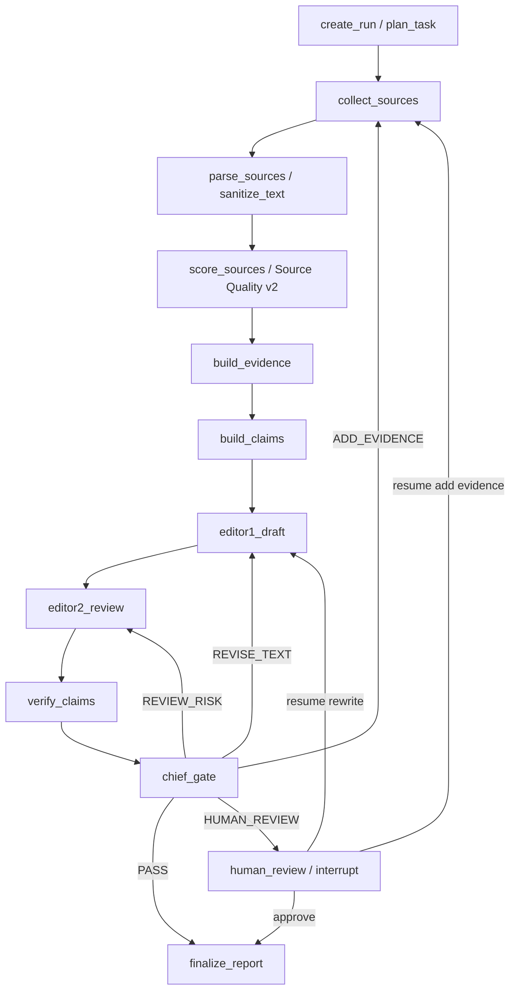

# LangGraph Research Workflow Harness v1

Status: pending_next_slice_design_provider_backed_slice2_completed

Created: 2026-06-11

Primary active PLAN: user_requested_design_sidecar

## Objective

重构当前 Deep Research / agent 探讨流程，把现有线性同步 pipeline 升级为
证据驱动、状态持久化、可失败恢复、可审计的 LangGraph workflow harness。

目标不是增加更多自由聊天式 agent，而是建立：

```text
确定性数据管道
  -> 证据链 / claim graph
  -> 有界 agent loop
  -> Chief Reviewer 质量门禁
  -> checkpoint / resume / trace / dossier
```

## Task Classification

- Primary area: `research_workflow`
- Secondary areas:
  - `task_substrate`
  - `memory_feedback`
  - `provider_layer`
  - `eval_policy_ops`
  - `source_layer`
- Protected contracts:
  - Do not silently change `/deep-research/analyze` response shape.
  - Do not silently change `/research/analyze` response shape.
  - Do not silently change `DeepResearchReport`, `EvidenceItem`, or
    `SourceAssessment` public schema.
  - Do not silently change legacy `runs` / `run_steps` meaning.
  - Do not remove existing dossier generation or `research_reports.dossier_path`.

## Current Baseline

当前项目已有可复用基础：

- `packages/agents/deep_research.py`
  - 当前 Deep Research 是一个同步线性大函数：query understanding ->
    search -> source tiering -> evidence chain -> multi-agent debate ->
    counter-evidence -> report assembly。
  - 已有 visible trace，但 trace 主要存在内存 context 和 dossier 中。
  - 已发现下游 LLM 输入混入页面 chrome，Parser/Structurer 出现 invalid JSON。
- `packages/agents/workflow.py`
  - legacy research workflow 已使用 `Run` / `RunStep` 记录阶段状态。
  - `_run_step` 能记录输入、输出、失败，但还不是可 resume 的 checkpoint。
- `packages/db/models/entities.py`
  - 已有 `runs`、`run_steps`、`task_jobs`、`task_attempts`、`memory_records`。
  - 这些可以承接 v1 harness 的运行记录和 task worker，不必从零开始。
- `packages/tasks/**`
  - 已有自研任务队列、idempotency key、attempt、retry 状态。
  - 可以先复用，不急着引入 Celery / Temporal。
- `packages/research_reports/dossier.py`
  - 已有 human-readable dossier。
  - 新 harness 应继续把 graph node trace、prompt/input/output、gate decision
    写入 dossier。
- `packages/sources/source_quality.py`
  - 已有 Source Quality v2 shadow layer。
  - 新下游 agent 应消费 compact source quality capsule，而不是只吃原文。
- `packages/memory/**`
  - 已有轻量 memory repository，但 memory type 还偏主题/内容策略/用户偏好。
  - 新 harness 可先复用 `RUN_MEMORY`，后续再扩展 procedural/source/critique
    memory。

当前缺口：

- `pyproject.toml` 还没有 LangGraph 依赖。
- Deep Research 没有 graph state / checkpoint / resume。
- 业务数据仍主要打包在最终 report JSON 和 dossier context 中，缺少稳定的
  source/evidence/claim/draft/issue node-state 边界。
- 下游 agent prompt 太薄，缺少 claim-level support matrix 和 ReviewIssue
  驱动的闭环。
- 失败恢复停留在 task/job 级，不能从 graph 中间节点恢复。

## Target Architecture

### Key Term Glossary

- `LangGraph`：一个用于构建有状态 agent workflow 的编排框架。这里用它管理
  节点顺序、条件路由、循环、暂停和恢复，而不是让 agent 自由对话。
- `StateGraph`：LangGraph 的状态图。它定义每个节点如何读取和更新
  `ResearchGraphState`。
- `checkpoint`：检查点。每个重要节点完成后保存 workflow state，使任务失败或
  服务重启后能从最近状态恢复。
- `thread_id`：LangGraph 用来定位同一次 workflow 运行的标识。建议使用
  `research_run:{run_id}`。
- `Context Pack`：上下文包。每个 agent 看到的不是全量原始网页，而是经过清洗、
  裁剪、结构化后的输入。
- `Chief Gate`：总负责人质量门禁。它不是普通写作 agent，而是规则 + LLM judge
  + router，输出 `PASS`、`ADD_EVIDENCE`、`REVISE_TEXT`、`HUMAN_REVIEW` 等决策。
- `ReviewIssue`：审稿问题结构。Editor2 / Verifier 输出它，Chief Gate 根据它
  路由下一步。
- `idempotency`：幂等性。节点允许被重复执行，但不能重复插入来源、证据、草稿或
  issue。

### Recommended Package Layout

第一版建议新建独立 harness 包，避免继续膨胀 `deep_research.py`：

```text
packages/research_harness/
  __init__.py
  state.py
  schemas.py
  graph.py
  router.py
  context.py
  persistence.py
  tracing.py
  quality_gate.py
  nodes/
    plan_task.py
    collect_sources.py
    parse_sources.py
    score_sources.py
    build_evidence.py
    build_claims.py
    editor_writer.py
    editor_critic.py
    verifier.py
    chief_gate.py
    finalize_report.py
    human_review.py
```

现有 `DeepResearchAgent` 不立即删除。v1 先提供并行 runner：

```text
DeepResearchAgent              当前线性实现，作为稳定对照
LangGraphResearchRunner        新 harness 实现，先 feature flag / strategy opt-in
```

## Target Pipeline



## Reuse Of Existing `run_id` And `task_id`

结论：必须复用现有 `run_id` 和并行/异步任务体系，不另造一套互不兼容的任务 ID。

现有项目里有两类 ID：

- `run_id`：来自 `runs.id`，表示一次研究 workflow 运行。新 LangGraph run 应继续
  使用这个 ID 作为主业务运行 ID。
- `task_id` / `task_job_id`：来自 `task_jobs.id`，表示一次 worker 队列任务。
  它负责异步调度、attempt、retry、dead-letter，不应该替代 `run_id`。

新的 graph state 应明确保存两者：

```python
class ResearchGraphState(TypedDict):
    run_id: int
    task_job_id: int | None
    thread_id: str
```

推荐映射：

```text
runs.id                 -> run_id
task_jobs.id            -> task_job_id
LangGraph thread_id     -> research_run:{run_id}
run_steps.run_id        -> run_id
research_reports.run_id -> run_id, if added later; current report table may keep report id
```

这样做的好处：

- API 同步调用可以只创建 `run_id`，不一定创建 `task_job_id`。
- 异步 worker 调用可以创建 `task_job_id`，payload 中携带或创建 `run_id`。
- 失败恢复时复用同一个 `thread_id = research_run:{run_id}`。
- task retry 不会重复创建业务 run，只会恢复同一个 graph run。

设计要求：

- 不改变现有 `runs` / `run_steps` 的基本语义。
- `run_steps` 继续作为 node-level trace 表使用。
- 新增 graph checkpoint 表时，外键优先指向 `run_id`。
- `TaskJob` 只做调度外壳，不承载 claim/evidence/draft 等业务状态。

## Evidence Evaluation In The New Flow

结论：evidence 评估必须进入新流程，而且要和 source 评估分层，不要混在一起。

分层关系：

```text
Source Quality v2
  判断一个来源是否权威、及时、可审计、适合用作哪类证据

Evidence Assessment
  判断某个证据片段是否能支持某个具体 claim

Chief Gate
  汇总 source/evidence/claim/review issue，决定通过、补证据、重写或人工审核
```

在 graph 中的位置：

```text
score_sources
  -> build_evidence
  -> assess_evidence
  -> build_claims
  -> verify_claims
  -> chief_gate
```

第一版可把 `assess_evidence` 合并在 `build_evidence` 或 `verify_claims` 中实现，
但 trace 和 dossier 里必须单独显示 evidence 评估结果。

建议新增内部结构，不改变 public `EvidenceItem` schema：

```json
{
  "evidence_assessment": {
    "evidence_id": "ev_001",
    "source_id": "src_001",
    "claim_ids": ["claim_003"],
    "support_type": "direct_support",
    "support_strength": 0.82,
    "specificity": "procurement_award_notice",
    "limitations": ["只证明项目中标，不证明收入确认"],
    "missing_for_stronger_claim": ["合同金额", "履约进度", "财务确认"],
    "evaluator_mode": "rule_then_llm_if_needed"
  }
}
```

字段解释：

- `support_type`：证据支持类型。表示这个证据是直接支持、间接支持、背景支持、
  反向证据，还是不能支持某个 claim。
- `support_strength`：支持强度。表示该证据对具体 claim 的支撑强弱，不属于 source
  层评分。
- `specificity`：证据粒度。表示它是政策条款、采购中标公告、项目备案、财务指标、
  专家观点等哪类证据。
- `limitations`：证据边界。表示这个证据不能证明什么。
- `missing_for_stronger_claim`：若想把 claim 写得更强，还缺什么证据。
- `evaluator_mode`：评估方式。记录是规则评估、本地模型、远程 LLM，还是混合方式。

与原先源评级方案的关系：

- A/B/C/D 和 Source Quality v2 继续用于 `score_sources`。
- Evidence Assessment 用于 `assess_evidence` / `verify_claims`。
- Evidence Judge 不再泛泛评价 thesis，而是输出 claim-level support matrix。

## Caliber Expansion Integration

结论：原 Deep Research 里的口径扩展不能丢，应该变成新 graph 的第一层规划节点。

现有能力：

- `CALIBER_EXPANSION_PROMPT`
- `QueryUnderstanding`
- `ResearchDimension`
- `MultiRoundSearchPlan`
- `SearchRoundPlan`

新 graph 中的承接方式：

```text
plan_task
  -> query_understanding
  -> caliber_expansion
  -> source_obligation_plan
  -> search_round_plan
```

`plan_task` 输出必须包含：

```json
{
  "normalized_query": "...",
  "research_dimensions": [],
  "caliber_terms_by_dimension": {},
  "source_obligations": [
    {
      "obligation_id": "obl_procurement_award",
      "source_family": "public_resource_transaction",
      "required_for": "公共资源采购中标证据",
      "min_required_evidence": 1
    }
  ],
  "search_rounds": []
}
```

这样原先“口径扩展 query / 每个扩展 query 搜索得到的源 / 最终选择使用的源”的 dossier
能力可以继续保留，并升级为：

- 哪个 `caliber_term` 触发了哪个 search phrase。
- 哪个 search phrase 找到了哪个 source。
- 哪个 source 满足了哪个 source obligation。
- 哪个 evidence 支持了哪个 claim。
- 哪些 obligation 未满足，因此 Chief Gate 要求 `ADD_EVIDENCE`。

## State Design

State 里只放 ID、状态、路由信息和小型摘要，不放完整 HTML/PDF/长正文。

```python
class ResearchGraphState(TypedDict):
    run_id: int
    task_job_id: int | None
    thread_id: str
    query: str
    strategy: str

    current_node: str | None
    source_ids: list[str]
    evidence_ids: list[str]
    claim_ids: list[str]
    draft_ids: list[str]
    issue_ids: list[str]

    source_quality_ids: list[str]
    context_pack_ids: list[str]
    trace_event_ids: list[str]

    loop_count: int
    max_loop_count: int
    decision: str | None
    quality_scores: dict[str, float]
    error: dict[str, object] | None
```

解释：

- `source_ids`：指向来源记录，具体正文存数据库或对象存储。
- `evidence_ids`：指向证据片段，供 claim/verifier/report 使用。
- `claim_ids`：指向可验证断言，不直接等同最终报告段落。
- `draft_ids`：每一轮报告草稿版本。
- `issue_ids`：Editor2 / Verifier 发现的问题。
- `context_pack_ids`：每个 agent 输入上下文包的存档，方便 dossier 审计。
- `trace_event_ids`：节点运行、LLM 调用、工具调用的可审计记录。

## Persistence Design

### Reuse Existing Tables

第一阶段复用：

- `runs`
  - 记录一次 graph run。
  - `input_json.pipeline = "langgraph_research_harness_v1"`。
  - `output_json` 保持最终摘要，不塞所有中间大对象。
- `run_steps`
  - 记录每个 graph node 的开始、完成、失败、跳过。
  - 扩展使用 `input_json.input_hash` / `output_json.output_ref`。
- `task_jobs` / `task_attempts`
  - 继续作为 worker 入口和 retry 外壳。
- `research_reports`
  - 继续保存最终 report JSON 和 `dossier_path`。
- `memory_records`
  - 短期先写 run-level lessons / procedural hints 到 `RUN_MEMORY`。

### Add New Tables

v1 需要新增或等价实现的业务状态表：

```text
research_graph_checkpoints
research_context_packs
research_sources
research_evidence_items
research_claims
research_claim_evidence_links
research_draft_versions
research_review_issues
research_quality_gate_results
research_trace_events
```

如果短期不想一次加太多表，可以分两步：

1. 先用 `run_steps.input_json/output_json` + `research_context_packs` + dossier
   跑通 graph。
2. 再拆出正式 `claims` / `review_issues` / `quality_gate_results` 表。

但 `research_review_issues` 和 `research_claim_evidence_links` 不应长期只放在
大 JSON 里，否则 Chief Gate 很难做稳定路由。

## Failure Recovery Design

### Three-Layer Recovery

1. Node retry
   - 处理 Tavily / crawler / provider transient error。
   - 复用 `packages/tasks` 的 attempts 和 retry delay。
2. Graph checkpoint resume
   - LangGraph checkpoint 记录最近 state。
   - 使用 `thread_id = research_run:{run_id}` 恢复。
3. Business idempotency
   - 每个节点可以重复执行。
   - URL、content_hash、evidence_hash、claim_hash、draft_version、issue_key
     必须去重或 upsert。

### Node-Level Idempotency Rules

- `collect_sources`
  - unique `(run_id, normalized_url)`。
  - 已存在 URL 不重复插入，只更新 metadata。
- `parse_sources`
  - unique `(source_id, content_hash)`。
  - parse failed 不中断全 run，标记 `parse_status=failed`。
- `build_evidence`
  - unique `(run_id, source_id, evidence_hash)`。
- `build_claims`
  - unique `(run_id, claim_hash)`。
- `editor1_draft`
  - 每次生成新 `draft_version`，不覆盖旧 draft。
- `editor2_review`
  - unique `(run_id, draft_id, issue_type, target_claim_id, issue_hash)`。
- `chief_gate`
  - 每次 gate 记录一条 decision event。

## Agent Contract Redesign

### Editor1 / Writer

输入：

- `Research Context Pack`
- source quality capsule
- evidence table
- claim candidates
- known conflicts
- output schema

输出：

```json
{
  "draft_version": 1,
  "sections": [
    {
      "section_id": "sec_001",
      "title": "政策与采购证据概览",
      "paragraphs": [
        {
          "paragraph_id": "p_001",
          "text": "...",
          "claim_ids": ["claim_001"],
          "evidence_ids": ["ev_001", "ev_004"],
          "confidence": "medium",
          "limitations": ["尚未取得公共资源交易中标公告"]
        }
      ]
    }
  ]
}
```

### Editor2 / Critic

输出必须是 `ReviewIssue`，不要只写自然语言评论：

```json
{
  "issues": [
    {
      "issue_id": "issue_001",
      "severity": "blocker",
      "issue_type": "unsupported_claim",
      "target_claim_id": "claim_003",
      "description": "该 claim 声称存在中标证据，但当前证据只有政策文件。",
      "required_fix": "补充公共资源交易中心中标公告或政府采购成交公告。",
      "suggested_search_queries": ["低空经济 中标公告 公共资源交易中心"]
    }
  ]
}
```

### Verifier

职责是 claim-level 核验：

- 每个 claim 是否有 source/evidence 支持。
- 引用 URL 是否真实存在。
- source quality usage role 是否允许支撑该 claim。
- 是否存在过期、错配或低质量来源。

### Chief Gate

输出：

```json
{
  "decision": "ADD_EVIDENCE",
  "reason": "采购中标证据 obligation 未满足",
  "route_to": "collect_sources",
  "required_actions": [
    {
      "type": "ADD_EVIDENCE",
      "target_claim_id": "claim_003",
      "required_source_family": "public_resource_transaction"
    }
  ],
  "quality_scores": {
    "evidence_coverage": 0.68,
    "citation_integrity": 0.92,
    "source_quality": 0.83,
    "contradiction_resolution": 0.7,
    "final_score": 0.73
  }
}
```

Routing rule:

```python
if unsupported_key_claims > 0:
    return "ADD_EVIDENCE"
if citation_integrity < 0.95:
    return "REVISE_TEXT"
if blocker_issues > 0:
    return "ADD_EVIDENCE"
if loop_count >= max_loop_count:
    return "HUMAN_REVIEW"
if final_score >= 0.82:
    return "PASS"
return "REVISE_TEXT"
```

## Context Pack Design

每个 agent 拿不同上下文：

| Agent | Context Pack |
| --- | --- |
| Planner | 原始 query、用户偏好、任务类型、验收标准模板 |
| Collector | query decomposition、source obligations、补证据 issue |
| Parser | source metadata、原始正文路径、清洗规则 |
| Evidence Builder | 清洗正文、表格、source quality capsule |
| Claim Builder | evidence table、query obligations、source sufficiency |
| Editor1 | claim graph、evidence table、source quality、report schema |
| Editor2 | draft、claim-evidence map、critique memory、risk taxonomy |
| Verifier | draft、claims、evidence、citations、source quality |
| Chief Gate | scores、issues、loop state、acceptance criteria |

Context Pack 必须保存：

- `context_pack_id`
- `agent_name`
- `prompt_version`
- `input_hash`
- `included_source_ids`
- `included_evidence_ids`
- `sanitization_summary`
- `token_estimate`

## Memory Design

本 PLAN 采用三分法：

```text
Workflow State     当前 run 状态，用于恢复
Evidence Store     source/evidence/claim，用于支撑结论
Long-term Memory   偏好、流程规则、来源信誉、审稿模式
```

v1 只做轻量 memory 注入：

- `Preference Memory`
  - 用户偏好：证据链清晰、避免泛泛宏观判断、优先一手来源。
- `Procedural Memory`
  - 报告/审稿/Chief Gate 规则。
- `Source Memory`
  - 域名信誉、解析质量、来源等级。
- `Critique Memory`
  - 常见漏洞，如“政策规划不等于项目落地”“中标证据必须有交易/采购公告”。

不做：

- 不把所有网页总结写入 long-term memory。
- 不把未验证 claim 固化成长期事实。
- 不让 Editor1 直接写 long-term memory。

## API Strategy

### Phase 1 API Compatibility

不直接替换现有接口。新增 opt-in：

- Option A:
  - `/deep-research/analyze` 增加可选 `workflow_version="langgraph_v1"`。
- Option B:
  - 新增 `/deep-research/graph/analyze`。

建议先用 Option B，风险更低。

原 `/deep-research/analyze` 保持现状，作为对照基线。

### Async / Resume API

第二步再加：

```text
POST /deep-research/graph/runs
GET  /deep-research/graph/runs/{run_id}
POST /deep-research/graph/runs/{run_id}/resume
GET  /deep-research/graph/runs/{run_id}/dossier
```

## Phase Plan

### Phase 0 - Architecture Gate And Dependency Decision

目标：

- 确认 LangGraph 版本和依赖。
- 确认 Postgres checkpointer 策略。
- 确认短期是否使用现有 `packages/tasks`，还是引入 Celery。

建议：

- 现在先不引入 Celery / Temporal。
- 先用 LangGraph + 现有 `TaskJob` / `TaskWorker`。
- Temporal 延后，等任务跨小时/跨天且有强 SLA 再考虑。

产出：

- 依赖变更方案。
- graph state schema。
- migration sketch。
- compatibility note。

### Phase 1 - Graph Skeleton In Shadow Mode

目标：

- 新建 `packages/research_harness`。
- 添加 `ResearchGraphState`。
- 实现 LangGraph skeleton：
  - `plan_task`
  - `collect_sources`
  - `parse_sources`
  - `score_sources`
  - `build_evidence`
  - `build_claims`
  - `editor1_draft`
  - `editor2_review`
  - `verify_claims`
  - `chief_gate`
  - `finalize_report`
- 先用 mock/offline provider 跑通。
- 生成 graph trace dossier。

不做：

- 不替换现有 DeepResearchAgent。
- 不改 public response schema。

### Phase 2 - Evidence Sanitization And Context Pack

目标：

- 实现 LLM-prompt-only evidence sanitizer。
- 保存 raw text 和 clean text 的差异摘要。
- 生成 per-agent context pack。
- 确保 `[首页]`、`打印`、`javascript:void(0)`、空图片 markdown 不进入
  downstream agent prompt。

验收：

- 用 `data/tmp/source_quality_v2_live_api/dossier.md` 中的污染样例做回归测试。

### Phase 3 - Structured Agent Contracts

目标：

- 重写 Editor1 / Editor2 / Verifier / Chief Gate prompt。
- 输出全部 Pydantic 校验。
- 对 invalid JSON 做 retry / repair / structured fallback。
- Evidence Judge 升级为 claim-level support matrix。

注意：

- 这些先作为内部 graph state，不改 `DeepResearchReport` public schema。

### Phase 4 - Persistence And Resume

目标：

- 添加 graph checkpoint repository。
- run step 记录 `input_hash`、`output_hash`、`retry_count`。
- 支持同一个 `run_id/thread_id` resume。
- 关键节点幂等 upsert。
- 失败后保留已抓来源、证据、草稿、issue、gate decision。

验收场景：

- 模拟 `parse_sources` 失败后 resume。
- 模拟 LLM JSON 失败后 retry / fallback。
- 模拟 `chief_gate=ADD_EVIDENCE` 回到 source collection。
- 模拟 `loop_count >= max_loop_count` 进入 human review。

### Phase 5 - Task Worker Integration

目标：

- 新增 task type 或 payload mode：`RESEARCH_GRAPH_ANALYZE`。
- `TaskWorker` 可执行 graph run。
- task retry 与 graph resume 协同：
  - task retry 不重复写业务结果。
  - graph resume 使用同一 thread_id。

### Phase 6 - Dossier V3

目标：

- dossier 增加 Graph Run 视图：
  - state transitions
  - node attempts
  - context pack summaries
  - prompt versions
  - sanitization summary
  - claim-evidence matrix
  - review issues
  - chief gate decision history
  - resume / retry events

### Phase 7 - Real API Shadow Run

目标：

- 使用真实 DeepSeek + Tavily 跑一条低成本 query。
- 与当前 `DeepResearchAgent` 同 query 对照：
  - source count
  - evidence count
  - unsupported claims
  - invalid JSON count
  - prompt noise hits
  - loop_count
  - dossier 可读性
  - API elapsed time / estimated credits

## Validation Plan

必须运行：

- `python -m py_compile` on changed files。
- changed-file `python -m ruff check ...`。
- `pytest -q tests/test_research_api.py`
- `pytest -q tests/test_agents_workflow.py`
- `pytest -q tests/test_research_provider_integration.py`
- `pytest -q tests/test_deepseek_provider.py`
- `pytest -q tests/test_tasks_service.py`
- `pytest -q tests/test_tasks_api.py`

新增测试：

- `tests/test_research_harness_state.py`
- `tests/test_research_harness_graph.py`
- `tests/test_research_harness_context.py`
- `tests/test_research_harness_recovery.py`
- `tests/test_research_harness_dossier.py`

必须覆盖：

- graph skeleton produces schema-valid state。
- context sanitizer removes observed page chrome。
- each node records run_step / trace event。
- invalid JSON triggers retry/fallback。
- idempotent re-run does not duplicate sources/evidence/issues。
- chief gate routes PASS / ADD_EVIDENCE / REVISE_TEXT / HUMAN_REVIEW。
- public legacy response shapes remain unchanged。

## Module-Level Validation Gates

每完成一个模块，不进入下一模块前必须有对应验证。不要等完整 graph 写完才一起测。

| Module | Completion Criteria | Required Validation |
| --- | --- | --- |
| State schema | `ResearchGraphState` 能表达 run/task/thread、source/evidence/claim/draft/issue、loop/decision/error | `tests/test_research_harness_state.py`：schema validate、empty/default state、state merge/update、large text not stored in state |
| ID reuse / persistence | `run_id` 复用 `runs.id`，`task_job_id` 复用 `task_jobs.id`，`thread_id=research_run:{run_id}` | persistence unit test：创建 run、绑定 task job、恢复同一 thread_id、不会创建重复 run |
| Graph skeleton | LangGraph 节点顺序和 conditional routing 能跑通 mock state | `tests/test_research_harness_graph.py`：PASS / ADD_EVIDENCE / REVISE_TEXT / HUMAN_REVIEW 四类路由 |
| Caliber expansion | 原 Deep Research 的 query understanding、research dimensions、caliber terms、search rounds 被 `plan_task` 继承 | fixture test：输入采购/政策 query，输出包含 source obligations 和 expanded search phrases |
| Context pack | 每个 agent 只收到属于自己的清洗后上下文 | `tests/test_research_harness_context.py`：不同 agent pack 字段不同；包含 `input_hash`、`prompt_version`、`sanitization_summary` |
| Evidence sanitizer | 页面 chrome 不进入下游 LLM prompt | 污染样例回归：`[首页]`、`打印`、`javascript:void(0)`、空图片 markdown、语言导航被移除 |
| Source Quality integration | Source Quality v2 capsule 进入 Evidence Builder / Editor / Verifier / Chief Gate | unit test：source family mismatch 的 source 不可作为 primary claim support |
| Evidence assessment | 每个 evidence 可被评估为支持/不支持具体 claim | `tests/test_research_harness_evidence_assessment.py`：direct support、background only、not sufficient、counter evidence |
| Claim graph | claim 能追溯到 evidence 和 source | test：claim-evidence-source link 完整；缺 evidence 的 claim 被标记 unsupported |
| Editor1 contract | draft 每个关键段落带 `claim_ids` 和 `evidence_ids` | structured output test：非法 claim id / evidence id 被拒绝或降级 |
| Editor2 contract | 输出 `ReviewIssue` list，不接受泛泛自然语言 | structured output test：severity、issue_type、target_claim_id、required_fix、suggested_search_queries 必填 |
| Verifier | claim-level citation/support check 可运行 | test：不存在 URL、低质量 source、source usage_role 不匹配时产生 issue |
| Chief Gate | 根据分数和 issue 路由 | unit test：unsupported key claim -> ADD_EVIDENCE；citation_integrity low -> REVISE_TEXT；loop max -> HUMAN_REVIEW |
| JSON retry/fallback | LLM invalid JSON 不导致整个 run 黑箱失败 | mock provider test：第一次 invalid JSON，第二次 repair 成功；仍失败则 structured fallback |
| Checkpoint/resume | 中断后能从同一 run 恢复 | recovery test：parse node fail 后 resume；chief_gate ADD_EVIDENCE 后回 collect_sources |
| Task worker integration | worker retry 不重复写业务结果 | `tests/test_tasks_service.py` + 新 graph task test：同一 idempotency key 不重复创建 sources/evidence/issues |
| Dossier V3 | dossier 能显示 graph node、context pack、evidence assessment、issue、gate history | `tests/test_research_harness_dossier.py`：关键章节存在且无 secret |
| API shadow endpoint | 新接口不影响旧接口 | `tests/test_research_api.py`：旧 `/deep-research/analyze` shape 不变；新 graph endpoint opt-in 可用 |

模块完成定义：

```text
code written
  + unit/focused tests pass
  + changed-file ruff/py_compile pass
  + run_steps/trace/dossier visibility checked where applicable
  + PLAN progress updated
```

禁止做法：

- 不允许只靠一次 end-to-end live run 证明模块正确。
- 不允许为了让 graph 跑通而跳过 evidence assessment。
- 不允许把 source quality 和 evidence support 混成一个平均分。
- 不允许让旧 public response schema 悄悄增加/删除字段。

## Risks

- LangGraph dependency may introduce version/API instability; pin version and keep graph runner
  isolated.
- 一次性加太多业务表会扩大迁移风险；建议 checkpoint/context/review issue 先落地，
  claim/source 业务表分阶段拆出。
- 如果过早替换 `/deep-research/analyze`，会破坏当前已经验证的 live path。
- 如果 state 塞入长正文，checkpoint 会膨胀，恢复慢且难审计。
- 如果 Chief Gate 太依赖 LLM 主观判断，loop 仍然不可控；必须保留 deterministic gates。
- Human review API 是产品面能力，第一版可以只做 internal pause/resume，不急着 UI 化。

## Open Decisions

1. API strategy:
   - 推荐新增 `/deep-research/graph/analyze`，而不是立刻给旧接口加行为分支。
2. Persistence strategy:
   - 推荐先复用 `runs` / `run_steps`，新增 minimal graph checkpoint/context 表。
3. Task strategy:
   - 推荐先复用现有 `TaskJob`，暂不引入 Celery。
4. Memory strategy:
   - 推荐先做 procedural/source/critique memory 的读取注入，写入延后到 Memory Curator。

## Progress

### 2026-06-11 - Initial construction plan drafted

Inputs reviewed:

- User-provided GPT discussion notes on evidence-gated pipeline.
- User-provided GPT discussion notes on harness engineering.
- User-provided GPT discussion notes on LangGraph / persistence / recovery.
- User-provided GPT discussion notes on memory taxonomy.
- Current project files:
  - `packages/agents/deep_research.py`
  - `packages/agents/workflow.py`
  - `packages/agents/deep_research_schemas.py`
  - `packages/tasks/**`
  - `packages/memory/**`
  - `packages/db/models/entities.py`
  - `apps/api/routes/deep_research.py`
  - `apps/api/routes/research.py`

Finding:

- The current project already has useful run/task/dossier/memory foundations,
  but Deep Research remains a synchronous linear pipeline.
- The correct migration is shadow-mode LangGraph harness first, not direct
  replacement of existing endpoints.

### 2026-06-11 - User clarification incorporated

Clarified design requirements:

- Existing `run_id` must be reused from `runs.id`.
- Existing parallel/async task identity must be reused from `task_jobs.id` as
  `task_job_id`; graph recovery uses `thread_id=research_run:{run_id}`.
- Evidence assessment is an explicit processing layer and must not be collapsed
  into source scoring. Source Quality v2 answers whether a source is suitable;
  Evidence Assessment answers whether a specific evidence item supports a
  specific claim.
- Existing Deep Research caliber expansion is retained and becomes part of
  `plan_task`: query understanding, research dimensions, caliber terms, source
  obligations, and search round planning.
- Module-level validation gates are required after each design/implementation
  slice, not only at final end-to-end validation.

### 2026-06-11 - Phase 0/1 execution started

Execution mode:

- `full_subagent` risk profile by rule because the work touches
  `research_workflow`, `task_substrate`, `run` / `run_steps`, and user-visible
  research behavior.
- Current implementation path is still shadow-mode and compatibility-first:
  local implementation with full-subagent-level validation discipline, because
  the first slice is a new opt-in endpoint rather than a replacement of the
  legacy path.

Allowed write scope:

- `packages/research_harness/**`
- `apps/api/routes/deep_research.py`
- `tests/test_research_api.py`
- focused new tests under `tests/test_research_harness_*.py`
- minimal dependency/config updates required for LangGraph runtime
- PLAN / STATUS progress updates

Forbidden changes in this slice:

- No change to `/deep-research/analyze` response shape
- No change to `/research/analyze` response shape
- No change to public `DeepResearchReport`, `EvidenceItem`, `SourceAssessment`
  schemas
- No DB migration for new business tables in Phase 0/1
- No replacement of legacy `DeepResearchAgent`
- No live provider dependency in the first graph skeleton

Real-world validation added for this slice:

- `POST /deep-research/graph/analyze` must create a `runs` row and node-level
  `run_steps`
- response must expose `run_id`, `thread_id`, `status`, `decision`,
  `quality_scores`, and `node_steps`
- `run.input_json.pipeline` must be `langgraph_research_harness_v1`
- `thread_id` must be `research_run:{run_id}`
- chief gate must cover at least `PASS`, `ADD_EVIDENCE`, `REVISE_TEXT`,
  `HUMAN_REVIEW`
- legacy `/deep-research/analyze` test must still pass unchanged

### 2026-06-11 - Phase 0/1 shadow skeleton implemented

Implemented:

- Added `packages/research_harness/**` with:
  - `ResearchGraphState`
  - `GraphAnalyzeRequest` / `GraphAnalyzeResponse`
  - deterministic node set for `plan_task -> collect_sources -> parse_sources
    -> score_sources -> build_evidence -> build_claims -> editor1_draft
    -> editor2_review -> verify_claims -> chief_gate -> finalize_report`
  - actual LangGraph `StateGraph` conditional routing
  - `ResearchGraphRunner` that reuses `runs` / `run_steps`
- Added `POST /deep-research/graph/analyze`
- Preserved legacy `/deep-research/analyze`
- Added focused tests for state, graph routing, and API persistence behavior
- Added `langgraph` dependency to `pyproject.toml`

Validation:

- `python -m py_compile apps\\api\\routes\\deep_research.py packages\\research_harness\\__init__.py packages\\research_harness\\state.py packages\\research_harness\\schemas.py packages\\research_harness\\nodes.py packages\\research_harness\\graph.py packages\\research_harness\\runner.py tests\\test_research_harness_state.py tests\\test_research_harness_graph.py tests\\test_research_api.py` -> pass
- focused `python -m ruff check apps\\api\\routes\\deep_research.py packages\\research_harness tests\\test_research_harness_state.py tests\\test_research_harness_graph.py tests\\test_research_api.py` -> pass
- `pytest -q tests\\test_research_harness_state.py tests\\test_research_harness_graph.py tests\\test_research_api.py` -> `7 passed`
- `pytest -q tests\\test_agents_workflow.py` -> `11 passed`
- `pytest -q tests\\test_research_provider_integration.py` -> `9 passed`
- `pytest -q tests\\test_deepseek_provider.py` -> `2 passed`
- `python -m ruff check .` -> fails on pre-existing `.agent/hooks`, `.claude/worktrees`, and Unsloth cache files outside this slice; not introduced by the current shadow harness
- local shadow API smoke via `TestClient(app)` on `POST /deep-research/graph/analyze` -> `200`, `decision=PASS`, `node_count=20`
- smoke artifact: `data/tmp/langgraph_shadow_smoke/graph_api_smoke_summary.json`

Current behavior change:

- graph endpoint is now real and executable, but still deterministic/offline in
  node internals
- `run.input_json.pipeline = "langgraph_research_harness_v1"`
- `thread_id = research_run:{run_id}`
- `chief_gate` now demonstrates `ADD_EVIDENCE -> PASS` and `HUMAN_REVIEW`
  routing in tests

Open gaps deliberately deferred:

- no graph checkpoint persistence table yet
- no task-worker resume integration yet
- no real provider-backed source/evidence/claim generation yet
- no context pack persistence or sanitization summary yet
- no dossier v3 graph view yet

### 2026-06-11 - Phase 2 context-pack and sanitization summary implemented

Implemented:

- Added `packages/research_harness/context.py`
- Added `GraphContextPackSummary`
- Each graph node now emits a `context_pack_summary` into
  `run_steps.output_json`
- `POST /deep-research/graph/analyze` now returns `context_packs`
- Context pack includes:
  - `context_pack_id`: this node input pack's stable audit id
  - `prompt_version`: which prompt/contract version the node is running with
  - `input_hash`: hash of the node input fingerprint, used to compare whether
    two node runs consumed the same effective context
  - `included_source_ids`: which source objects were visible to the node
  - `included_evidence_ids`: which evidence objects were visible to the node
  - `included_claim_ids`: which claims were visible to the node
  - `included_issue_ids`: which review issues were visible to the node
  - `included_fields`: which major state fields were exposed to that node
  - `token_estimate`: rough size estimate of the node input context, used to
    observe prompt growth
  - `sanitization_summary`: what cleaning happened before downstream use

`sanitization_summary` meaning:

- `source_count`: how many source records the node saw
- `source_count_with_clean_text`: how many sources already had cleaned text
- `raw_text_chars`: total characters before cleaning
- `clean_text_chars`: total characters after cleaning
- `removed_markers`: which known page chrome markers were removed, such as
  `[首页]`, `打印`, `收藏`, `javascript:void(0)`
- `removed_marker_count`: number of distinct removed noise markers

Validation:

- focused `py_compile` on context-pack files and tests -> pass
- focused `ruff` on `packages/research_harness` and harness/API tests -> pass
- `pytest -q tests\\test_research_harness_state.py tests\\test_research_harness_graph.py tests\\test_research_api.py` -> `7 passed`

Behavior effect:

- the graph response is no longer only "step names + final score"
- we can now inspect, per node, what category of inputs it consumed and whether
  page chrome was removed before evidence/claim processing

## Next Action

Start the next Phase 2 slice: persist fuller context-pack payload references and
prepare dossier-visible graph trace sections, then move into Phase 4
checkpoint/resume design.

### 2026-06-11 - Graph dossier generation implemented

Implemented:

- Added graph dossier writer in `packages/research_reports/dossier.py`
- New shadow graph runs now write Markdown dossiers under:
  - `data/run_dossiers/deep_research_graph/<date>/run_<run_id>/dossier.md`
- `GraphAnalyzeResponse` now includes `dossier_path`
- `run.output_json` for the graph run now also stores `dossier_path`

Graph dossier sections:

- `Graph Overview`: node count, context-pack count, quality scores
- `Node Execution Trace`: node / agent / status / output summary table
- `Context Packs`: compact table plus per-pack detail blocks
- `Final Report Preview`: final preview JSON
- `Graph Glossary`: Chinese explanations for graph keywords such as
  `context_pack_id`, `prompt_version`, `input_hash`, `included_source_ids`,
  `token_estimate`, `sanitization_summary`, `removed_markers`, and `node_steps`

Validation:

- focused `py_compile` on graph dossier and harness files -> pass
- focused `ruff` on `packages/research_harness`, `packages/research_reports/dossier.py`,
  and dossier-related tests -> pass
- `pytest -q tests\\test_research_harness_state.py tests\\test_research_harness_graph.py tests\\test_research_api.py tests\\test_research_run_dossier.py` -> `11 passed`

Behavior effect:

- graph runs now have a human-readable Markdown audit artifact, not only API
  JSON and DB `run_steps`
- the dossier exposes context-pack summaries and node-level visible execution
  trace in a format suitable for manual review

Remaining gap:

- current graph dossier is based on `run.output_json` + graph context and is not
  yet persisted through `research_reports` like Deep Research report dossiers
- checkpoint/resume and fuller context payload storage are still Phase 4 work

### 2026-06-11 - Phase 3 structured agent contracts implemented

Implemented:

- Added `packages/research_harness/contracts.py`
- Added `packages/research_harness/phase3.py`
- Rebuilt `packages/research_harness/nodes.py` on top of structured contract
  helpers
- `Editor1` now emits validated `EditorDraftOutput`
- `Editor2` now emits validated `ReviewIssueList`
- `Verifier` now emits validated `VerifierOutput` with claim-level support
  results
- `Chief Gate` now emits validated `ChiefGateOutput` with:
  - `decision`
  - `reason`
  - `route_to`
  - `required_actions`
  - `quality_scores`
  - `loop_count`

Phase 3 keyword meaning:

- `claim_verifications`: verifier 对每个 claim 的结构化核验结果。它回答这个
  claim 是 `supported`、`partially_supported`、`unsupported` 还是
  `contradicted`，以及支持分数和所依赖的 evidence/source。
- `required_actions`: chief gate 给下游节点的明确动作要求。它不是泛泛评论，
  而是告诉 pipeline 下一步该补证据、改文案、复审风险还是进入人工审阅。
- `contract_meta`: 每个结构化节点的 contract 执行元数据。它说明本次输出是
  直接校验成功、repair 成功，还是走了 structured fallback。
- `used_fallback`: 表示该节点没有得到合规的原始输出，系统改用了预定义的
  结构化兜底结果。这能帮助后续调试“模型输出坏了”与“业务逻辑坏了”的区别。
- `attempts`: contract 校验/修复过程的尝试记录。它告诉你是
  `validate_dict` 失败、`repair_json` 失败，还是最终 `structured_fallback`
  成功。

Invalid JSON retry / fallback behavior:

- current shadow implementation supports:
  - direct validation of dict-like output
  - JSON repair attempt for string-like broken output
  - structured fallback if repair still fails
- fallback is visible in `run_steps.output_json.contract_meta`
- fallback is covered by a focused graph test

Validation:

- focused `py_compile` on Phase 3 harness files -> pass
- focused `ruff` on `packages/research_harness` and graph/API/dossier tests -> pass
- `pytest -q tests\\test_research_harness_state.py tests\\test_research_harness_graph.py tests\\test_research_api.py tests\\test_research_run_dossier.py` -> `12 passed`

Behavior effect:

- graph outputs are no longer thin ad hoc dicts for the core review nodes
- unsupported claims now produce structured review issues and structured
  gate-required actions
- invalid structured outputs no longer silently collapse into a generic failure;
  they now leave diagnosable fallback metadata in the run trace

Next intended phase:

- Phase 4 checkpoint/resume and task-worker recovery integration

### 2026-06-11 - Phase 4 minimal checkpoint and resume implemented

Implemented:

- Added `packages/research_harness/checkpoints.py`
- Each graph run now writes a latest checkpoint file under:
  - `data/graph_checkpoints/run_<run_id>/latest.json`
- `GraphAnalyzeResponse` now includes:
  - `checkpoint_path`
  - `resumed_from_checkpoint`
- graph dossier header now includes checkpoint/resume status
- resume now reuses the same:
  - `run_id`
  - `thread_id = research_run:{run_id}`

Phase 4 keyword meaning:

- `checkpoint_path`: 当前 graph run 最近一次保存的 checkpoint 文件路径。它告诉你
  “如果这次中断，恢复入口要从哪里读状态”。
- `resumed_from_checkpoint`: 是否是从已有 checkpoint 恢复出来的这次 run。它回答
  “这是第一次执行，还是中断后的续跑”。
- `current_node`: checkpoint 保存时图当前停留的节点。恢复时它决定从哪个节点继续。
- `error.node_name`: 如果 run 因某个节点失败而中断，这个字段会记录失败节点名。
  恢复逻辑会优先从该失败节点重新执行，而不是跳过它。

Current recovery behavior:

- successful node execution saves a fresh checkpoint
- failed node execution also saves a checkpoint with:
  - `current_node`
  - `error`
  - updated `node_steps`
- resume behavior:
  - if last checkpoint has an error on node `X`, resume retries node `X`
  - if last checkpoint completed node `X` successfully, resume continues to the
    next routed node

Validation:

- focused `py_compile` on checkpoint/resume files -> pass
- focused `ruff` on harness + graph/API/dossier tests -> pass
- `pytest -q tests\\test_research_harness_state.py tests\\test_research_harness_graph.py tests\\test_research_api.py tests\\test_research_run_dossier.py` -> `14 passed`

Recovery tests now cover:

- same `run_id` resume from a successful checkpoint
- failed `parse_sources` node followed by resume on the same `run_id`
- resumed run reaches `succeeded` and leaves both failed and succeeded
  `parse_sources` step records in `run_steps`

Current scope boundary:

- checkpoint store is file-backed, not DB-backed yet
- task worker has not yet been taught to resume the graph automatically
- checkpoint granularity is run-level latest snapshot only, not versioned
  snapshots per attempt

Next intended phase:

- integrate checkpoint/resume with task-worker retry semantics and refine
  checkpoint storage boundaries

### 2026-06-11 - Phase 4 task-worker graph integration implemented

Implemented:

- Added graph-task submit schema in `packages/tasks/schemas.py`
- Added `TaskService.enqueue_graph_research(...)`
- Added new API route:
  - `POST /tasks/research/graph-analyze`
- Added graph-research branch in `packages/tasks/handlers.py`
- Graph task execution now reuses existing `TaskType.RESEARCH_ANALYZE` while
  routing by payload marker:
  - `workflow_version = "langgraph_v1"`
  - `graph_request = {...}`

Task integration behavior:

- first graph task run creates and executes a new graph `run_id`
- resume graph task can submit `resume_run_id`
- worker executes the resume request against the same graph `run_id`
- task result JSON exposes:
  - `run_id`
  - `thread_id`
  - `checkpoint_path`
  - `resumed_from_checkpoint`

Validation:

- focused `py_compile` on task files -> pass
- focused `ruff` on task files -> pass
- `pytest -q tests\\test_tasks_service.py` -> `5 passed`

New task test coverage:

- graph research task enqueue + worker execution
- graph result contains checkpoint/resume fields
- resume task reuses the same `run_id`
- resumed task still leaves graph node trace on the original run

Current boundary:

- task retry does not yet automatically transform an ordinary retry into a
  resume request; current resume is an explicit task submission path
- checkpoint store remains file-backed latest snapshot

Next intended phase:

- decide whether automatic retry should synthesize `resume_run_id` from
  `source_run_id`
- decide whether checkpoint storage should move into a DB-backed repository

### 2026-06-11 - Phase 4 automatic retry to resume mapping implemented

Implemented:

- Added retry-aware task failure payload handling for graph research tasks
- `RetryableTaskError` / `NonRetryableTaskError` can now carry:
  - `source_run_id`
  - `result_json`
- when a graph task fails retryably:
  - task row preserves `source_run_id`
  - task row preserves failed `result_json`
  - queued retry payload is rewritten so:
    - `graph_request.resume_run_id = source_run_id`

Behavior change:

- before: task retry for graph work only re-ran the same graph payload shape
- after: retryable graph failure automatically becomes a resume-capable payload
  for the same `run_id`

Validation:

- focused `ruff` on task files -> pass
- `pytest -q tests\\test_tasks_service.py` -> `6 passed`

New task retry coverage:

- retryable graph failure injects `resume_run_id` into queued payload
- second worker execution consumes that queued retry and succeeds as a resumed
  graph run

Current boundary:

- automatic retry to resume mapping is currently implemented at the task payload
  rewrite layer
- checkpoint persistence is still file-backed latest snapshot only
- DB-backed checkpoint repository decision remains open

### 2026-06-11 - DB-backed checkpoint repository implemented

Implemented:

- Added ORM model:
  - `ResearchGraphCheckpoint`
- Added Alembic migration:
  - `d4e5f6a7b8c9_add_research_graph_checkpoints.py`
- `GraphCheckpointRepository` is now DB-first:
  - save writes checkpoint state into `research_graph_checkpoints`
  - load reads from `research_graph_checkpoints` first
  - existing file `latest.json` remains as mirror/fallback for local inspection

DB checkpoint storage meaning:

- `research_graph_checkpoints.run_id`: which business graph run this checkpoint
  belongs to
- `thread_id`: the LangGraph thread identity, still aligned to
  `research_run:{run_id}`
- `current_node`: the last active node at checkpoint time
- `state_json`: the serialized graph state snapshot used for resume
- `saved_at`: checkpoint write time, distinct from generic row timestamps

Behavior effect:

- graph resume now prefers DB state, not file state
- tests prove this by deleting the mirrored checkpoint file before resume and
  still succeeding
- file checkpoint path remains in response only as an inspectable mirror, not
  the primary restore source

Validation:

- focused `py_compile` on DB model, migration, checkpoint repo, and graph tests -> pass
- focused `ruff` on DB model, migration, checkpoint repo, and graph tests -> pass
- `pytest -q tests\\test_research_harness_graph.py` -> `5 passed`
- Alembic validation on temp SQLite DB:
  - `python -m alembic -c packages/db/alembic.ini upgrade head` -> pass
  - inspected table `research_graph_checkpoints` exists with expected columns

Current storage stance:

- primary checkpoint source of truth: DB
- local operational mirror: file `data/graph_checkpoints/run_<run_id>/latest.json`
- next storage decision is no longer "whether to use DB", but whether the file
  mirror should stay long-term and whether checkpoint history should become
  versioned instead of latest-only

### 2026-06-11 - Post-change contract and task-flow validation completed

Validation sweep:

- `pytest -q tests\\test_research_api.py tests\\test_agents_workflow.py tests\\test_research_provider_integration.py tests\\test_deepseek_provider.py` -> `26 passed`
- `pytest -q tests\\test_tasks_service.py tests\\test_tasks_api.py` -> `7 passed`

Meaning:

- research-contract-check key suites passed after DB-backed checkpoint
  introduction
- task-flow-check key suites passed after automatic retry-to-resume mapping and
  DB checkpoint integration
- legacy research path, graph shadow path, task submission, worker execution,
  retries, and run traceability remain compatible in the focused validation
  surface

### 2026-06-11 - Versioned checkpoint history and graph run inspect/resume API implemented

Implemented:

- `research_graph_checkpoints` is now versioned by:
  - `run_id`
  - `checkpoint_version`
- Added Alembic migration:
  - `e5f6a7b8c9d0_version_graph_checkpoints.py`
- `GraphCheckpointRepository.history(...)` now returns checkpoint history in
  descending version order
- `GraphAnalyzeResponse` now includes `checkpoint_history`
- Added `ResearchGraphService`
- Added graph run APIs:
  - `GET /deep-research/graph/runs/{run_id}`
  - `POST /deep-research/graph/runs/{run_id}/resume`

History-related keyword meaning:

- `checkpoint_version`: the ordinal version number of a checkpoint for one
  `run_id`. It answers “which save point in the run history is this”.
- `checkpoint_history`: a compact list of checkpoint metadata exposed to the
  caller. It answers “how many times was this run checkpointed and at which
  nodes”.
- `saved_at`: the time that specific checkpoint version was written, not the run
  finish time.

Behavior effect:

- graph callers can now inspect a run after the fact without replaying it
- resume can now be triggered by run-oriented API, not only by `analyze` payload
  or task payload
- checkpoint history grows across resume attempts, making the recovery path
  auditable

Validation:

- focused `ruff` on harness + deep_research graph route + graph/api tests -> pass
- `pytest -q tests\\test_research_harness_graph.py tests\\test_research_api.py` -> `10 passed`

New API/history coverage:

- graph response exposes non-empty `checkpoint_history`
- resume increases the latest `checkpoint_version`
- `GET /deep-research/graph/runs/{run_id}` returns persisted graph run state
- `POST /deep-research/graph/runs/{run_id}/resume` resumes the same run id and
  returns updated history

### 2026-06-11 - Graph runs list API implemented

Implemented:

- Added `GraphRunSummary`
- Added `ResearchGraphService.list_runs(limit=...)`
- Added API route:
  - `GET /deep-research/graph/runs`

List API meaning:

- it returns recent graph-run summaries without requiring the caller to know
  `run_id` in advance
- each item includes:
  - `run_id`
  - `thread_id`
  - `status`
  - `decision`
  - `resumed_from_checkpoint`
  - latest `checkpoint_version`
  - latest checkpoint `saved_at`
  - `dossier_path`
  - run `created_at` / `finished_at`

Behavior effect:

- graph run management now supports:
  - list recent runs
  - inspect one run
  - resume one run
- this closes the basic operational loop for manual debugging and audit

Validation:

- focused `ruff` on harness + graph route + API tests -> pass
- `pytest -q tests\\test_research_api.py` -> `6 passed`

### 2026-06-11 - Graph runs filters and task linkage implemented

Implemented:

- graph run list now supports filters:
  - `status`
  - `resumed_only`
- graph run summary now includes `task_refs`

`task_refs` meaning:

- `task_refs` tells you which queued/worker tasks were linked to this graph run
- each task ref currently includes:
  - `task_id`
  - `status`
  - `attempt_count`
  - `idempotency_key`

Behavior effect:

- list endpoint can now answer:
  - show only resumed runs
  - show only succeeded or failed runs
  - show which tasks drove a given graph run
- this makes the graph run list usable as a bridge between research workflow
  debugging and task substrate debugging

Validation:

- focused `ruff` on harness + graph route + API tests -> pass
- `pytest -q tests\\test_research_api.py` -> `7 passed`

### 2026-06-12 - Graph dossier direct read API implemented

Implemented:

- Added `ResearchGraphService.get_run_dossier_text(run_id)`
- Added API route:
  - `GET /deep-research/graph/runs/{run_id}/dossier`

Behavior effect:

- graph debugging now supports a single API chain:
  - list runs
  - inspect one run
  - read the run dossier content directly
  - resume the same run
- caller no longer needs to manually dereference `dossier_path` from the local
  filesystem just to inspect the Markdown dossier

Validation:

- focused `ruff` on harness + graph route + API tests -> pass
- `pytest -q tests\\test_research_api.py` -> `7 passed`

### 2026-06-12 - Graph run list/detail debug summaries enhanced

Implemented:

- graph run summary/detail now exposes:
  - `gate_reason`
  - `last_failed_node`
  - `report_preview_summary`
- graph run list remains filterable by:
  - `status`
  - `resumed_only`
- graph run list continues to expose `task_refs`

Field meaning:

- `gate_reason`: latest visible chief-gate reason from the run output. It is the
  short answer to “why did this run end in this decision”.
- `last_failed_node`: last failed node found in `node_steps`. It is the short
  answer to “where did this run most recently break”.
- `report_preview_summary`: short executive-summary preview extracted from the
  run preview. It is the short answer to “what did this run roughly conclude”.

Behavior effect:

- graph run list/detail now supports quick triage without opening the full
  dossier:
  - current status
  - latest decision
  - latest gate reason
  - last failed node
  - short conclusion preview
  - linked task refs

Validation:

- focused `ruff` on harness + graph route + API tests -> pass
- `pytest -q tests\\test_research_api.py` -> `7 passed`

### 2026-06-11 - Dossier linkage and debug summary fields added to graph run list/detail

Implemented:

- graph run summary/detail now exposes:
  - `gate_reason`
  - `last_failed_node`
  - `report_preview_summary`

Field meaning:

- `gate_reason`: the most recent chief-gate reason visible from the run output.
  It answers “why did the gate make this decision”.
- `last_failed_node`: the latest failed node found in `node_steps`, if any.
  It answers “where did this run most recently break”.
- `report_preview_summary`: a short preview of the final report summary.
  It answers “what this run roughly concluded” without opening the full dossier.

Behavior effect:

- graph run list/detail can now be used for quick triage:
  - status + decision
  - why the gate decided so
  - whether a node failed and where
  - what the run concluded at a glance

Validation:

- focused `ruff` on harness + graph route + API tests -> pass
- `pytest -q tests\\test_research_api.py` -> `7 passed`

### 2026-06-12 - Checkpoint history compaction API implemented

Implemented:

- Added checkpoint repository operations:
  - `history_count(run_id)`
  - `compact(run_id, keep_latest=...)`
- Added structured response model:
  - `GraphCheckpointCompactionResult`
- Added service method:
  - `ResearchGraphService.compact_checkpoints(run_id, keep_latest=...)`
- Added API route:
  - `POST /deep-research/graph/runs/{run_id}/checkpoints/compact`

Compaction policy:

- Default behavior remains full retention; normal graph execution does not
  automatically delete checkpoint history.
- Compaction is explicit and run-scoped.
- The default `keep_latest` is `20`; callers may request `1..500`.
- The latest checkpoint must remain loadable after compaction, so resume remains
  viable.
- The file mirror `data/graph_checkpoints/run_<run_id>/latest.json` remains as
  an inspection artifact; DB remains the source of truth.

Field meaning:

- `keep_latest`: how many newest checkpoint versions to retain for this run.
  This is an operational retention parameter, not a graph routing decision.
- `deleted_count`: how many older checkpoint rows were removed by this
  compaction call.
- `retained_count`: how many checkpoint rows remain after compaction.
- `latest_checkpoint_version`: the newest checkpoint version retained, which is
  also the version resume should load from DB.

Behavior effect:

- graph operators can keep full history while debugging, then compact old
  checkpoints for a specific run when storage grows.
- compaction no longer requires direct SQL deletion.
- tests prove a compacted run can still resume from the latest checkpoint.

Validation:

- `python -m ruff check packages\\research_harness apps\\api\\routes\\deep_research.py tests\\test_research_harness_graph.py tests\\test_research_api.py` -> pass
- `python -m py_compile packages\\research_harness\\checkpoints.py packages\\research_harness\\schemas.py packages\\research_harness\\service.py apps\\api\\routes\\deep_research.py tests\\test_research_harness_graph.py tests\\test_research_api.py` -> pass
- `pytest -q tests\\test_research_harness_graph.py` -> `6 passed`
- `pytest -q tests\\test_research_api.py` -> `8 passed`
- `pytest -q tests\\test_tasks_service.py tests\\test_tasks_api.py` -> `7 passed`
- `pytest -q tests\\test_agents_workflow.py tests\\test_research_provider_integration.py tests\\test_deepseek_provider.py` -> `22 passed`

Next action:

- Decide whether the file checkpoint mirror should stay permanently as a local
  inspection artifact or become optional/configurable.
- Then move to the next product-bearing phase: replacing shadow node stubs with
  real provider-backed source/evidence/claim node implementations while keeping
  `/deep-research/analyze` unchanged.

### 2026-06-12 - Provider-backed graph node slice 1 implemented

Architecture Gate:

- Classification: `research_workflow` primary; secondary `source_layer`, `provider_layer`, `task_substrate`, `eval_policy_ops`.
- Affected contracts: graph-only `GraphAnalyzeRequest` was extended with backward-compatible optional `execution_mode`; legacy `/deep-research/analyze`, `/research/analyze`, `DeepResearchReport`, `EvidenceItem`, `SourceAssessment`, and legacy research response shapes were not changed.
- Proposed boundary: keep `execution_mode="shadow"` as default deterministic harness path; opt into `execution_mode="provider_backed"` only for `/deep-research/graph/analyze` and graph resume APIs.
- Allowed write scope: `packages/research_harness/**`, graph route wiring, focused graph/API tests, PLAN/STATUS.
- Forbidden changes: no replacement of legacy DeepResearch pipeline, no public evidence/citation schema migration, no task status semantic change, no live provider call in unit tests.
- Validation design: fake search provider for provider-backed graph mode; focused ruff/compile; graph/API/task/research provider contract tests.
- Decision: proceed with first provider-backed early-node slice.

Implemented:

- Added `GraphAnalyzeRequest.execution_mode` with allowed values:
  - `shadow`: default deterministic graph harness path. It is used for offline tests, debugging, and compatibility checks.
  - `provider_backed`: opt-in graph path that uses real search-provider interfaces and Source Quality v2 scoring for early nodes.
- Added `packages/research_harness/real_nodes.py` with provider-backed implementations for:
  - `plan_task`: builds source obligations and search rounds from the query.
  - `collect_sources`: calls `SearchDiscoveryProvider` / `TavilySearchAdapter` through a fakeable provider boundary, records `search_events`, and deduplicates URLs.
  - `parse_sources`: sanitizes result text before downstream context packs.
  - `score_sources`: calls `assess_source_quality_v2(...)` and records deterministic source evaluator metadata.
  - `build_evidence`: builds internal evidence assessments from source quality usage role, source role, cleaned text, and limitations.
- Kept `packages/research_harness/nodes.py` as the node dispatcher so existing graph topology, checkpointing, run steps, and dossier flow continue to work.
- Updated graph context packs so provider-backed early nodes expose `provider_backed_v1.*` prompt/context versions.
- Updated graph resume API to preserve `execution_mode` from the resume request.
- Added focused fake-provider tests proving provider-backed mode can run without hitting real Tavily and still records source search events, context packs, Source Quality v2-backed evidence, and PASS gate behavior.

Keyword meaning:

- `execution_mode`: graph request field that chooses which implementation path the LangGraph harness uses. `shadow` means deterministic mock node behavior; `provider_backed` means early graph nodes use a real provider interface and real source-quality scoring.
- `provider_backed_v1`: internal strategy label stored in graph state and `runs.input_json`. It identifies the first real-provider-backed graph-node slice and lets checkpoints/dossiers distinguish it from shadow-mode runs.
- `search_events`: node output records from `collect_sources`. Each event describes which search phrase was sent to the search provider, how many results came back, estimated credits, and any provider errors. It is for debugging source acquisition, not for final user claims.
- `source_evaluator_mode`: per-source metadata showing how the source was scored. In this slice it is `deterministic_rules_source_quality_v2`, meaning Source Quality v2 rules were used rather than a local or remote LLM.
- `usage_role`: Source Quality v2 field that says how a source may be used downstream, such as primary evidence candidate, supporting candidate, context only, or excluded from primary evidence.

Validation:

- `python -m py_compile packages\research_harness\real_nodes.py packages\research_harness\nodes.py packages\research_harness\runner.py packages\research_harness\schemas.py packages\research_harness\service.py apps\api\routes\deep_research.py tests\test_research_harness_graph.py tests\test_research_api.py` -> pass
- `python -m ruff check packages\research_harness apps\api\routes\deep_research.py tests\test_research_harness_graph.py tests\test_research_api.py` -> pass
- `pytest -q tests\test_research_harness_graph.py tests\test_research_api.py` -> `16 passed`
- `pytest -q tests\test_tasks_service.py tests\test_tasks_api.py` -> `7 passed`
- `pytest -q tests\test_research_provider_integration.py` -> `9 passed`
- `pytest -q tests\test_deepseek_provider.py` -> `2 passed`
- `pytest -q tests\test_agents_workflow.py` -> `11 passed in 190.67s`; shorter 120s/180s runs timed out because this suite is slow, not because individual tests failed.

Behavior effect:

- Before: `/deep-research/graph/analyze` always used mock/shadow sources such as `mock-policy.html` and could only prove orchestration, checkpoint, and dossier mechanics.
- After: callers can explicitly request `execution_mode="provider_backed"`; graph early nodes then use a search provider boundary and Source Quality v2 scoring while preserving the same graph run/run_step/checkpoint/dossier infrastructure.
- Before: graph context packs only exposed `shadow_v1.*` versions.
- After: provider-backed runs expose `provider_backed_v1.plan_task`, `provider_backed_v1.collect_sources`, `provider_backed_v1.parse_sources`, `provider_backed_v1.score_sources`, and `provider_backed_v1.build_evidence` for audit.

Current boundary / risks:

- This is still a first slice, not a full replacement for `DeepResearchAgent`.
- Unit tests use fake search providers. A live Tavily/DeepSeek graph smoke is still pending and should be cost-capped.
- Downstream claim/review/final report nodes still use the existing structured shadow contract helpers; next slice should make claim construction and verifier prompts consume richer provider-backed source/evidence capsules.
- File checkpoint mirror remains unchanged; DB checkpoint is still source of truth.

Next action:

- Run one cost-capped live provider-backed graph smoke with `execution_mode="provider_backed"` after loading Tavily credentials, then inspect the graph dossier for source/search/evidence quality.
- Implement provider-backed claim/verifier slice so downstream agents consume real source/evidence capsules rather than thin generic claims.

### 2026-06-12 - Provider-backed downstream agent slice 2 implemented

Execution Mode:

- Mode: `remediation_gate -> local_direct`
- Reason: live provider-backed smoke exposed transient Tavily SSL EOF errors;
  the fix was narrow phrase-level retry/observability inside the graph-only
  provider-backed path.
- Risk triggers: external provider behavior and user-visible dossier quality.
- Protected contracts: legacy `/deep-research/analyze`, `/research/analyze`,
  `DeepResearchReport`, `EvidenceItem`, `SourceAssessment`, task status
  semantics, and public research response shapes remain unchanged.

Implemented:

- Added phrase-level retry/backoff in provider-backed `collect_sources`.
  Each `search_events` record now includes:
  - `attempt_count`: how many times this specific search phrase was attempted.
  - `retry_count`: how many retry attempts occurred after the first call.
  - `attempt_statuses`: compact status history such as `success` or `error`.
  - `retryable_error_count`: how many retryable provider errors were observed.
- Added fake-provider coverage for a retryable Tavily-style SSL EOF failure
  followed by success; the graph succeeds and the dossier-visible event records
  the retry.
- Made provider-backed downstream nodes consume real source/evidence/claim
  capsules instead of the generic shadow helpers:
  - `editor1_draft_provider_backed`
  - `editor2_review_provider_backed`
  - `chief_gate_provider_backed`
- Updated provider-backed context-pack prompt versions:
  - `provider_backed_v1.editor1_draft`
  - `provider_backed_v1.editor2_review`
  - `provider_backed_v1.chief_gate`
- Updated provider-backed final preview so it no longer says the run was
  shadow-mode.

Keyword meaning:

- `attempt_count`: 单个搜索短语实际调用 provider 的次数，用来判断一次搜索是否经历过重试。
- `retry_count`: 首次调用之后追加的重试次数；例如值为 `1` 表示第一次失败后又试了一次。
- `attempt_statuses`: 单个搜索短语每次尝试的状态列表；它用于还原 provider transient error 是否被恢复。
- `retryable_error_count`: 被标记为可重试的 provider 错误数量；它不是最终失败数，而是 provider 不稳定性的观测指标。
- `input_mode`: 节点 `contract_meta` 里的输入模式标记；`provider_backed_v1` 表示该 agent 消费的是真实 source/evidence/claim 胶囊，而不是 shadow mock 输入。

Validation:

- `python -m ruff check packages\research_harness apps\api\routes\deep_research.py packages\research_reports\dossier.py tests\test_research_harness_graph.py tests\test_research_api.py tests\test_research_run_dossier.py` -> pass
- `python -m py_compile packages\research_harness\real_nodes.py packages\research_harness\nodes.py packages\research_harness\context.py tests\test_research_harness_graph.py` -> pass
- `pytest -q tests\test_research_harness_graph.py tests\test_research_api.py tests\test_research_run_dossier.py` -> `22 passed`
- `pytest -q tests\test_tasks_service.py tests\test_tasks_api.py tests\test_research_provider_integration.py tests\test_deepseek_provider.py` -> `18 passed`
- post-summary focused check:
  - `python -m ruff check packages\research_harness\nodes.py tests\test_research_harness_graph.py` -> pass
  - `python -m py_compile packages\research_harness\nodes.py tests\test_research_harness_graph.py` -> pass
  - `pytest -q tests\test_research_harness_graph.py` -> `9 passed`

Live validation:

- Artifact: `data/tmp/langgraph_provider_backed_live_v7/summary.json`
- Endpoint path exercised through `ResearchGraphRunner` with
  `execution_mode="provider_backed"`, `max_rounds=2`, `max_loop_count=1`.
- Query: `2025年低空经济政策与公共资源采购中标证据 官方来源`
- Result:
  - status: `succeeded`
  - decision: `PASS`
  - final_score: `0.89`
  - search_event_count: `6`
  - search_success_count: `6`
  - search_error_count: `0`
  - estimated_credits: `6`
  - retry_event_count: `1`
  - max_attempt_count: `2`
  - provider-backed editor/review/gate context packs: present
  - dossier contains Search Events and Claim Verifications sections

Current boundary / risks:

- The provider-backed graph path is still opt-in and does not replace legacy
  Deep Research.
- The new retry is intentionally phrase-level and capped; it reduces transient
  SSL EOF impact but does not hide provider instability. Future live checks
  should continue reading `search_success_count`, `search_error_count`, and
  `retry_event_count`.
- Live validation scripts with Chinese queries must use Unicode escape or UTF-8
  files in Windows PowerShell; direct Chinese literals through a pipe can
  corrupt the query before it reaches Python.
- Dossier now confirms provider-backed through Source Hunter, Evidence Builder,
  Claim Builder, Editor1, Editor2, Verifier, and Chief Gate. The remaining
  product gap is richer content-asset generation after the gate.

Next action:

- Add a small live-smoke helper script or Make target so provider-backed graph
  validation can be rerun without inline PowerShell Chinese encoding risk.
- Then design the next slice for content-asset generation and/or persistent
  business tables for sources/evidence/claims if the graph path is promoted
  beyond opt-in evaluation.

### 2026-06-12 - Provider-backed live-smoke helper added

Implemented:

- Added `scripts/graph_provider_backed_smoke.py`.
- Added Makefile target:
  - `graph-provider-backed-smoke`
- The script:
  - loads Tavily settings from local `.env` into the current process only;
  - does not print or persist raw credentials;
  - runs `ResearchGraphRunner` with `execution_mode="provider_backed"`;
  - writes `summary.json` and `response.json` under the requested output dir;
  - copies the generated dossier into the same output dir as `dossier.md` so
    repeated temp SQLite runs do not overwrite the only readable dossier through
    a reused `run_1` path;
  - reports search success/error counts, retry counts, estimated credits,
    provider-backed editor/review/gate context-pack presence, and dossier
    section presence.

Validation:

- `python scripts\graph_provider_backed_smoke.py --help` -> pass
- `python -m ruff check scripts\graph_provider_backed_smoke.py` -> pass
- `python -m py_compile scripts\graph_provider_backed_smoke.py` -> pass
- `Select-String -Path Makefile -Pattern '^graph-provider-backed-smoke:','graph_provider_backed_smoke.py --reset'` -> pass

Validation caveat:

- `make -n graph-provider-backed-smoke` could not run because the current
  Windows environment does not have `make` installed.
- `ruff` cannot validate Makefile syntax; it treats Makefile as Python if the
  file is passed directly. Makefile validation in this environment used
  target/command presence checks instead.

Next action:

- Design the next product-bearing slice:
  - either content-asset generation after `chief_gate`,
  - or persistent source/evidence/claim business tables if the graph path is
    promoted beyond opt-in evaluation.
