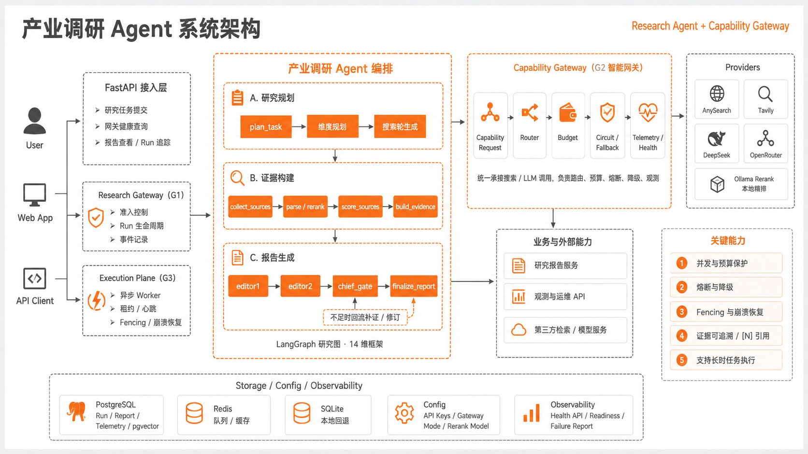

# Industry Research Agent（产业调研 Agent）

[](https://www.python.org/)
[](LICENSE)
[](https://langchain-ai.github.io/langgraph/)
[](https://fastapi.tiangolo.com/)
[](https://ollama.com/)
[](https://deepseek.com/)

**生产级中文产业调研 Agent**——基于固定研究维度框架，自动完成「检索 → 证据构建 → 多章节研报生成」的端到端产业调研，输出带编号引用、可审计的中文深度研报。

专为**产业调研**设计：给定一个产业主题（如"低空经济""动力电池"），Agent 按 14 个研究维度（产业定义/政策/市场/产业链/供给/需求/技术/项目/商业/风险/企业/资本/区域/趋势）自动检索、构建证据、分章节撰写报告。

> 定位为行业情报与研究辅助，不构成证券投资建议。

## 📄 示例报告

### 不同产业

| 产业 | 报告 | 指标 |
|---|---|---|
| **低空经济** | [低空经济中标公告深度研究报告](examples/reports/低空经济中标公告深度研究报告.html) | 30,338 字 · 142 条证据 · evidence_coverage 0.93 |
| **动力电池** | [动力电池产业链调研](examples/reports/动力电池产业链调研.html) | 28,067 字 · 65 条证据 · evidence_coverage 0.90 |
| **智能网联汽车** | [智能网联汽车产业链调研](examples/reports/智能网联汽车产业链调研.html) | 19,055 字 · evidence_coverage 0.67 |

### 不同地域

| 地域 | 报告 | 指标 |
|---|---|---|
| **合肥（市级）** | [合肥低空经济产业调研](examples/reports/合肥低空经济产业调研.html) | 25,057 字 · evidence_coverage 0.93 |

> 报告由 Agent 自动生成：检索 → 精排 chunk → 分章节撰写 → 编号引用，可直接打开浏览。

## ✨ 核心能力

- **固定研究维度框架**：14 维（10 基础 + 4 条件）覆盖产业调研全链路，跨产业可复用
- **证据驱动**：每条结论标注证据编号 `[N]`，末尾来源说明列编号→来源，可审计
- **两阶段检索**：固定维度基本搜索 → 未覆盖维度深度补搜，少而精
- **LLM 生成维度搜索词**：一次调用生成 14 维定向检索词，贴合 query 语义
- **精排 chunk 构建 evidence**：本地 LLM reranker（Ollama + LoRA）精排，evidence 按 slot 限量 + 维度保底
- **分章节并行生成**：每维度独立 LLM 调用（ThreadPool 并行），3 万字深度研报
- **本地可部署**：Ollama 本地 reranker + DeepSeek/任意 OpenAI 兼容 LLM，无需远程 GPU
- **维度覆盖 gate**：按维度 evidence 覆盖度判定 PASS/HUMAN_REVIEW，允许空缺并标注
- **智能网关**：LLM/Search Provider 路由 + 电路熔断 + 并发预算 + 健康观测 API

## 🛡 智能网关（Capability Gateway）

搜索与 LLM 请求经智能网关路由，提供生产级可靠性：

- **Provider 路由**：AnySearch/Tavily 搜索、DeepSeek LLM 的路由与 fallback 链
- **电路熔断**（G2.4）：连续失败自动 OPEN，避免雪崩；恢复探测
- **并发预算**（G2.3）：按 provider 配额并发，防止过载
- **健康观测 API**：
  - `GET /api/gateway/health` — 网关综合健康（各 provider 快照 + circuit 状态）
  - `GET /api/gateway/providers` — 各 provider 详细快照（成功率/超时/限流/5xx/延迟 p50/p95/fallback）

```
GET /api/gateway/providers
→ {"anysearch.primary": {"attempt_count": 120, "success_count": 118,
    "transport_success_rate": 0.98, "latency_p95_ms": 420,
    "dimensions": {"availability": "healthy", "latency": "normal", ...}}}
```

## 🏗 架构



**关键组件**：
- `research_taxonomy.py` — 14 维产业研究框架（单一事实源）
- `plan_semantic.py` — LLM 维度搜索词生成 + 搜索轮规划
- `retrieval_rank.py` — 粗排 BM25+向量 RRF → chunk → LLM 精排
- `real_nodes.py` — evidence 构建（slot 限量 + 维度保底）+ 分章节报告生成
- `rag/rerankers.py` — Ollama/vLLM 精排（0-4 分档 + logprobs）
- `capability_gateway/` — Provider 路由 + 并发预算 + 电路熔断 + 健康观测

**生成流程**：
```
LLM 生成 14 维搜索词 → 两阶段检索（基本搜索 + 未覆盖补搜）
→ 粗排 → chunk → Ollama 精排（662 chunks，0-4 分档）
→ evidence（slot 限量 + 维度保底 5 条）
→ 分章节并行生成（每维度独立 LLM，ThreadPool 8）
→ 维度覆盖 gate → 3 万字研报 + 审计附录
```

## 🚀 快速开始

1. 创建环境并安装依赖：
   ```bash
   make install
   ```
2. 配置环境变量：
   ```bash
   cp .env.example .env
   # 填入 DEEPSEEK_API_KEY（报告 LLM）、ANYSEARCH_API_KEY（搜索）
   # RERANK_ENDPOINT=http://localhost:11434/v1/chat/completions（Ollama 本地精排）
   # RERANK_MODEL=invest-rerank-v6（Qwen2.5-3B + v6 LoRA）
   # EDITOR1_GENERATION_MODE=per_dimension（分章节报告）
   ```
3. 本地 Ollama 精排模型（可选，无则回退确定性精排）：
   ```bash
   ollama pull qwen2.5:3b-instruct
   cd data/rerank_cloud_train/output/ollama_rerank_v6_qwen25_3b
   ollama create invest-rerank-v6 -f Modelfile
   ```
4. 运行产业调研：
   ```bash
   python -c "from packages.research_harness.runner import ResearchGraphRunner; ..."
   ```
   或通过 API：`POST /api/deep_research`

## 📊 验证效果

| 产业主题 | 结果 | 报告 | evidence |
|---|---|---|---|
| 低空经济 中标公告 | PASS（13/14 维）| 30,338 字符 | 142 |
| 动力电池 产业链 | PASS（18/20 维）| 28,067 字符 | 65 |

## ⚙ 主要配置

| 配置 | 说明 | 默认 |
|---|---|---|
| `SEARCH_DISCOVERY_PROVIDER` | 搜索 provider | anysearch |
| `RERANK_ENDPOINT` | 本地精排端点 | Ollama :11434 |
| `RERANK_MODEL` | 精排模型 | invest-rerank-v6 |
| `EDITOR1_GENERATION_MODE` | 报告生成模式 | per_dimension |
| `MAX_ROUNDS` | 搜索轮数上限 | 12 |

## 🗺 技术栈

- **语言**：Python 3.11+
- **框架**：LangGraph（研究图编排）、FastAPI（API）
- **存储**：PostgreSQL / SQLite、pgvector
- **LLM**：DeepSeek（报告撰写）、Ollama + LoRA（本地精排）、AnySearch（搜索）

## Monorepo Layout

- `apps/api` - FastAPI service
- `apps/worker` - task queue worker service
- `packages/core` - shared configuration, logging, and utilities
- `packages/db` - SQLAlchemy models, repositories, and Alembic migration setup
- `packages/ingestion` - source fetch/store/parse/chunk/persist ingestion pipeline
- `packages/agents` - deterministic multi-agent research workflow (v1) with provider abstraction
- `packages/providers` - shared LLM transport abstraction and DeepSeek provider client
- `packages/content` - deterministic content factory layer for multi-platform asset generation
- `packages/delivery` - delivery job orchestration with review/approval and deterministic dispatch connectors
- `packages/tasks` - PostgreSQL/SQLite-backed async task queue, worker claim/execute loop, retries, idempotency
- `packages/rag` - RAG interface placeholders
- `packages/memory` - durable memory extraction/search and growth-feedback loop services
- `packages/evals` - deterministic eval rubrics, smoke runner, and eval persistence
- `packages/policy` - deterministic policy/guardrail checks for research/content/delivery
- `packages/sources` - source-intelligence contracts, in-memory source registry, rule-based source router, MCP-style tool skeletons
- `packages/registry` - versionable template/policy/style-pack registry
- `packages/ops` - readiness and recent-failure reporting services
- `infra` - local Docker Compose and infrastructure notes
- `tests` - API, config, and database tests

## Local Setup

1. Create and activate a virtual environment.
2. Install dependencies:
   ```bash
   make install
   ```
3. Copy environment file and adjust values as needed:
   ```bash
   cp .env.example .env
   ```
4. Optional for live DeepSeek research mode:
   - set `DEEPSEEK_API_KEY`
   - prefer `DEEPSEEK_RESEARCH_MODEL=deepseek-chat` for faster structured JSON workflows
   - optional per-step model routing via:
     - `DEEPSEEK_MODEL_SUPERVISOR_INTAKE`
     - `DEEPSEEK_MODEL_THESIS_BUILDER`
     - `DEEPSEEK_MODEL_OPPONENT`
     - `DEEPSEEK_MODEL_EVIDENCE_JUDGE`
     - `DEEPSEEK_MODEL_RISK_ANALYST`
     - `DEEPSEEK_MODEL_SYNTHESIZE_MEMO`
   - keep `LLM_PROVIDER=mock` for safe default unless you explicitly want live LLM mode

PowerShell tip:
- `Invoke-RestMethod` renders nested arrays as `System.Object[]` in table/list view.
- To inspect full nested payload, pipe to JSON:
  ```powershell
  $resp = Invoke-RestMethod -Method Post -Uri "http://127.0.0.1:8000/research/analyze" -ContentType "application/json" -Body '{"query":"humanoid robot 2026 revenue path","top_k":6,"mode":"llm","provider":"deepseek"}'
  $resp | ConvertTo-Json -Depth 100
  ```

## Run Commands

- Start local infra (PostgreSQL + Redis):
  ```bash
  make up
  ```
- Run API:
  ```bash
  make dev-api
  ```
- Run worker:
  ```bash
  make dev-worker
  ```
- Run one worker tick (claim one eligible task if exists):
  ```bash
  make task-worker-once
  ```
- Stop local infra:
  ```bash
  make down
  ```

## Compact System Run Logs

Runtime audit logs are enabled by default through:

```bash
SYSTEM_RUN_LOG_ENABLED=true
SYSTEM_RUN_LOG_DIR=data/run_logs
SYSTEM_RUN_LOG_MAX_VALUE_CHARS=240
SYSTEM_RUN_LOG_MAX_ITEMS=8
```

Each workflow writes compact JSONL files named by UTC runtime and task name, for example:

```text
20260426T010203Z_research-analyze_run-42.jsonl
```

The logs record concise `input`, `decision`, `output`, and `error` summaries for research,
content generation, delivery, and async task execution. They intentionally redact sensitive
keys and reasoning fields, and they truncate large values to keep logs small.

## Database Migrations and Seed

- Apply migrations:
  ```bash
  make migrate-up
  ```
- Roll back one migration:
  ```bash
  make migrate-down
  ```
- Seed a tiny traceability dataset (theme -> document -> chunk -> thesis -> evidence link):
  ```bash
  make seed-dev
  ```
- List current tables for the configured database:
  ```bash
  make db-tables
  ```

## Ingestion Endpoints

- `POST /ingest/file` - multipart file upload ingestion (`.txt`, `.md`, `.html`)
- `POST /ingest/url` - URL-based ingestion for standard web pages
- `GET /documents/{document_id}` - document metadata and status
- `GET /documents/{document_id}/chunks` - chunk summaries and citations

## Retrieval Endpoints (RAG v1)

- `POST /search/chunks` - chunk-level retrieval with metadata filters and explainable scoring
- `POST /search/evidence-bundle` - auditable evidence bundle builder for downstream thesis/content agents

## Source Registry Layer (Step 3.1)

Implemented:
- unified source schemas/contracts (`QueryContext`, `SourceProfile`, `ToolRequest/ToolResponse`, `EvidenceBundle`)
- in-memory source registry with adapter profiles
- deterministic rule-based source router
- MCP-style internal tool registry skeleton:
  - `route_research_sources`
  - `fetch_user_provided_source`
  - `search_source_documents`
  - `fetch_document_detail`
  - `extract_evidence_items`
  - `build_evidence_bundle`
- adapter skeletons: `user_input`, `sec_edgar`, `world_bank`, `eia`, `who_gho`

Intentionally not implemented in this step:
- full source crawling
- browser automation
- network-facing MCP server
- production-grade adapter fetch pipelines

## Source Adapters V1 (Step 3.2)

Functional adapters in this step:
- `user_input`:
  - supports `inline_text`, `source_uri` (http/file), and `file_ref`
  - returns `RawDocument`, `NormalizedDocument`, and `EvidenceItem` when text is available
- `world_bank`:
  - minimal support for `indicator_code`, `country_codes`, and `date_range`
  - can produce normalized series output and evidence from latest observations
- `eia`:
  - minimal support for `series_id` and `api_key`
  - supports series normalization and evidence extraction from latest observation
- `sec_edgar`:
  - minimal support for ticker-based recent filing search (optional `form_type`)
  - produces filing metadata detail and evidence items

Still intentionally out of scope:
- full pagination coverage for every source
- advanced auth extensions and credential rotation
- browser/html/pdf collectors for unstructured source acquisition
- deep citation enrichment and entity linking

## Multi-Agent Research Endpoints

- `POST /research/analyze` - run multi-agent workflow over retrieved evidence (`mode=mock` by default, `mode=llm` + `provider=deepseek` supported)
- `GET /research/runs/{run_id}` - inspect persisted run and step outputs for auditability

### Source-Assisted Research (Step 3.3)

`POST /research/analyze` now supports an optional source-acquisition pre-stage:

- Legacy mode (default): `enable_source_acquisition=false`
  - uses existing retrieval + evidence bundle path
- Source-assisted mode: `enable_source_acquisition=true`
  - runs source routing/search/detail/evidence/bundle before research agents
  - then hands off a typed evidence bundle to the same research workflow

Current request fields for source-assisted mode:
- `enable_source_acquisition` (bool, default `false`)
- `max_sources` (optional int)
- `max_docs_per_source` (optional int)
- `source_ids` (optional list, explicit override)
- `include_user_sources` (bool, default `true`)
- `user_provided_sources` (optional list; supports inline text/url/file_ref payloads)
- `enable_pdf_processing` (bool, default `false`)
- `max_pdf_attachments_per_source` (optional int, bounded in adapter)
- `max_pdf_pages_per_attachment` (optional int, bounded in extractor)

Response now includes `source_acquisition` summary:
- `enabled`
- `routed_sources`
- `documents_found`
- `evidence_items_found`
- `bundle_id`
- `source_quality_summary`
- `source_traces`
- `truncated_sources`
- `pdf_summary` (`enabled`, `attachments_discovered`, `attachments_processed`, `pages_extracted`, `pdf_evidence_items_found`, `errors`)
- `notes`

Source adapters currently usable in this path:
- `user_input`
- `world_bank` (narrow indicator subset)
- `eia` (narrow series subset)
- `sec_edgar` (ticker/filing metadata subset)

Out of scope in this step:
- browser automation
- full crawler behavior
- replacing the legacy retrieval pipeline

### Source Hardening (Step 3.4)

The source-acquisition layer is now hardened for safer production-like behavior:

- bounded pagination/limits:
  - request-level `limit`, `page`, `offset`
  - `max_docs_per_source` and `max_evidence_per_source` honored in source-assisted flow
  - truncation flags and counts surfaced in traces/metadata
- retry/backoff helper:
  - adapter HTTP calls use bounded retry + backoff
  - retry metadata is captured for audit (`retry_count`, retryable/non-retryable failures)
- richer trace/audit fields:
  - `source_id(s)`, request params summary, `http_calls`, `page_count`
  - `item_count`, `evidence_count`, `latency_ms`, `retry_count`
  - `adapter_version`, `truncated`, `warnings`
- citation normalization:
  - evidence citations normalized with `source_name`, `source_id`, `title`, `url`
  - `published_at`, `retrieved_at`, `locator`, `external_id` enriched when available
- source-quality summary:
  - `sources_attempted`, `sources_succeeded`, `sources_failed`
  - `source_error_breakdown`, `citation_completeness_score`, `evidence_density`
  - `truncated_sources`, `warnings`

Current hardened adapters in scope:
- `user_input`
- `world_bank`
- `eia`
- `sec_edgar`

Known current limitations:
- retry behavior is local helper-based (not global distributed rate limiter)
- source pagination depth remains narrow and source-specific
- no browser/html/pdf collectors in this step

### Source Evals and Router Optimization (Step 3.5)

Implemented in this step:

- source-level deterministic eval grading dimensions:
  - availability/success
  - evidence yield
  - citation completeness
  - trace completeness
  - query fit
  - operational stability
- source smoke eval flow covering:
  - `macro -> world_bank`
  - `energy -> eia`
  - `filing/company -> sec_edgar`
  - `user_input`
- source performance summary aggregation from recent research run metadata:
  - `attempt_count`, `success_count`, `partial_count`, `failure_count`, `no_result_count`
  - `avg_latency_ms`, `avg_evidence_density`, `avg_citation_completeness`, `last_seen_at`
- transparent router scoring (deterministic):
  - rule match score
  - trust bonus
  - query-fit bonus
  - historical success bonus
  - evidence density bonus
  - citation completeness bonus
  - failure penalty
  - no-result penalty
  - latency penalty

New/extended APIs:

- `POST /evals/run-source-smoke`
- `GET /evals/source-runs/{eval_run_id}`
- `GET /ops/sources/performance`

Router output now includes richer recommendation metadata:
- `final_score`
- `score_breakdown`
- `query_type`
- `selected_via`
- `matched_terms`

Still intentionally heuristic in this step:
- no opaque ML routing model
- no RL/adaptive learning loop
- no browser automation collectors
- no dashboard UI yet

## Domestic Source Collector Foundation (Step 4.1)

Implemented in this step:
- domestic collector contracts under `packages/sources/collectors/`
  - `BaseCollector`
  - `CollectorRequest` / `CollectorResponse`
  - `DiscoveredItem`
  - `DetailPageContent`
  - `PdfArtifact`
  - `PdfTextPage`
  - `PdfTextDocument`
  - `ChinaCitation`
- lightweight placeholder collector implementations:
  - `HtmlListDetailCollector`
  - `PdfFetchCollector`
  - `PdfTextExtractCollector`
- domestic source profile families under `packages/sources/profiles/`
  - `cn_policy_generic`
  - `cn_exchange_announcement_generic`
  - `cn_industry_association_generic`
- domestic citation normalization contract and document-normalization helpers
- source registry integration for domestic profile families
  - registered and inspectable
  - disabled by default to avoid affecting existing source-assisted flows

What these contracts are designed to support next:
- policy portals
- exchange/company announcement portals
- industry association or institute portals
- html list/detail extraction
- pdf attachment discovery
- pdf text extraction and later page-aware citation locators

Intentionally not implemented in Step 4.1:
- browser automation
- OCR
- real site-specific domestic scrapers
- auth/login collectors
- deep pagination
- binary PDF parsing from live downloads
- domestic source eval integration

### Domestic Profile Execution Bridge (Step 4.1.5)

Implemented in this step:
- `GenericProfileSourceAdapter`
  - executes collector-backed domestic `SourceProfile` definitions
  - currently supports `collector_type=html_list_detail`
  - returns normal `ToolResponse` / `EvidenceItem` outputs for the existing source toolchain
- `LiveHtmlFetchService`
  - lightweight live HTML fetch with timeout, retry/backoff, encoding hints, and structured failure metadata
- `CollectorExecutorFactory`
  - explicit mapping from profile metadata to collector implementation
  - currently: `html_list_detail -> HtmlListDetailCollector`
- domestic router extension
  - can recommend domestic profile families for Chinese/notice-style queries when domestic collector profiles are enabled
  - examples:
    - `cn_policy_generic` for policy / notice / guidance / `??` / `??` / `??`
    - `cn_exchange_announcement_generic` for announcement / disclosure / exchange / `??` / `??` / `??`
    - `cn_industry_association_generic` for association / alliance / industry report / `??` / `??` / `???`
- registry integration
  - default registry now attaches generic adapters to domestic profiles
  - domestic profiles remain disabled by default, so existing international source-assisted research behavior does not change

What this now enables:
- a profile-driven domestic source can be made execution-ready by enabling the profile
- the existing source toolchain can now do:
  - route -> fetch list HTML -> discover items -> fetch detail HTML -> normalize documents -> extract evidence
- mocked/demo domestic source-assisted bundle generation is now possible without adding site-specific scraper code

Still intentionally out of scope in this bridge step:
- browser automation
- OCR
- deep pagination
- site-specific anti-bot handling
- auth/login flows
- per-site parser specialization
- deep PDF extraction

Planned for Step 4.2:
- first usable domestic HTML collectors over selected sites
- browser fallback for JS-rendered pages where truly necessary
- PDF download + basic text extraction path
- richer pagination handling and site-rule specialization

### First Real Domestic Collectors (Step 4.2)

Selected real domestic sources:
- `cn_policy_ndrc_tzgg_v1`
  - site: National Development and Reform Commission (`https://www.ndrc.gov.cn/xwdt/tzgg/index.html`)
  - why selected:
    - official policy/notice portal
    - static list/detail HTML
    - detail pages often expose PDF attachments in a stable block
    - high research value for policy and industry-guidance tracking
- `cn_exchange_szse_notice_v1`
  - site: Shenzhen Stock Exchange notice/disclosure portal (`https://www.szse.cn/disclosure/notice/general/index.html`)
  - why selected:
    - official announcement/disclosure source
    - stable detail pages
    - list page can be parsed without browser automation via explicit script-defined link extraction
    - high research value for exchange notices and disclosure events

Implemented in this step:
- two real domestic `SourceProfile` definitions with concrete:
  - `entry_urls`
  - selectors
  - `collector_type`
  - `detail_required`
  - `pdf_expected`
  - `pagination_mode`
  - citation/publisher metadata
- real selector/parser rules for:
  - NDRC list item extraction, detail parsing, and PDF attachment discovery
  - SZSE script-defined list items, detail parsing, and evidence normalization
- live list/detail fetch through `LiveHtmlFetchService`
- evidence-ready outputs:
  - normalized documents
  - evidence items
  - normalized citations
- source tool/service integration through the existing:
  - `GenericProfileSourceAdapter`
  - `CollectorExecutorFactory`
  - `SourceRegistry`
  - `SourceIntelligenceService`

Current limitations:
- no browser automation fallback
- no OCR
- no deep pagination
- no anti-bot tuning
- PDF processing is bounded and opt-in (default disabled)
- SZSE list parsing currently relies on an explicit `script` parser rule for the current page shape

Manual verification:
- NDRC policy demo
  - enable `cn_policy_ndrc_tzgg_v1`
  - fetch first-page list HTML
  - confirm at least one list item, one normalized detail page, and attachment refs when present
- SZSE notice demo
  - enable `cn_exchange_szse_notice_v1`
  - fetch first-page list HTML
  - confirm script-defined links are discovered, detail page normalizes, and evidence items are produced

### Domestic PDF Attachment Pipeline (Step 4.3)

Implemented in this step:
- live PDF download service (`LivePdfDownloadService`):
  - attachment URL download with timeout/retry/backoff
  - local artifact persistence under `RAW_STORAGE_DIR/source_pdfs/<source_id>/`
  - metadata including `sha256`, bytes size, latency, retry count, warnings
- minimal PDF text extraction service (`PdfTextExtractionService`):
  - page-level extraction via `pypdf`
  - typed `PdfTextDocument` + `PdfTextPage` output
  - bounded extraction via `max_pdf_pages_per_attachment`
  - structured failures for missing/corrupt/zero-text PDFs
- PDF normalization:
  - converted PDF text into `RawDocument` + `NormalizedDocument`
  - preserves attachment ref/url, extractor metadata, and page-level sections
- page-level citation/evidence support:
  - citation locator now supports `page_number` when evidence comes from PDF pages
  - evidence metadata preserves `from_pdf_attachment`, `attachment_ref`, and page linkage
- domestic source integration:
  - `GenericProfileSourceAdapter.fetch_document_detail()` can optionally process discovered PDF attachments
  - controlled by payload flags (opt-in):
    - `enable_pdf_processing` (bool, default `false`)
    - `max_pdf_attachments_per_document` (default `2`, capped)
    - `max_pdf_pages_per_attachment` (default `20`, capped)
  - single-PDF failures are captured as structured errors and do not crash the whole flow

Still intentionally out of scope:
- OCR/scanned PDF handling
- table extraction and chart understanding
- browser fallback for hidden attachment links
- deep pagination across many site pages
- per-site anti-bot tuning

Planned for next step:
- OCR fallback for scanned attachments
- table-aware extraction for financial disclosures
- stronger per-site resilience and attachment discovery tuning

### PDF-As-First-Class Source-Assisted Capability (Step 4.4)

What Step 4.4 adds:
- PDF processing can now be explicitly controlled from top-level research requests.
- Source-assisted workflow propagates PDF settings into source adapter payloads.
- Research runs now include explicit PDF audit steps:
  - `pdf_discover_attachments`
  - `pdf_download`
  - `pdf_extract`
  - `pdf_extract_evidence`
- Research response `source_acquisition.pdf_summary` reports:
  - `enabled`
  - `attachments_discovered`
  - `attachments_processed`
  - `pages_extracted`
  - `pdf_evidence_items_found`
  - `errors`
- Async research task payloads support the same PDF fields and preserve idempotent behavior.

Out of scope remains:
- OCR fallback for scanned/image PDFs
- table/chart extraction
- advanced layout reconstruction
- per-site PDF strategy tuning

### Domestic Source Scaleout v2 (Phase 0 -> Phase 6)

What is added:
- Phase 0 inventory baseline encoded in `packages/sources/domestic_inventory.py`:
  - normalized report-code coverage `C01-C46`
  - template mapping table (10 template families)
  - pack-state table (`executable / beta / placeholder`)
  - first-wave sample shortlist for domestic rollout
- Phase 1 sample-validation profiles:
  - central policy: State Council / NDRC / MIIT
  - disclosure: SSE / SZSE / CNINFO
  - provincial + city sample lines
- Phase 2 backbone buildout:
  - `project_signal_pack_cn_v1` with procurement/trade/approval signals
  - `policy_pack_cn_v2` and `disclosure_pack_cn_v2` promoted to `executable`
- Phase 3 provincial rollout:
  - `local_rollout_pack_cn_v2` promoted to `executable`
  - expanded provincial profiles:
    - `cn_policy_anhui_drc_tzgg_v1`
    - `cn_policy_shandong_gxt_tzgg_v1`
    - `cn_policy_fujian_drc_tzgg_v1`
    - `cn_policy_henan_gxt_tzgg_v1`
- Phase 4 city and park rollout:
  - new city profiles:
    - `cn_policy_guangzhou_gxt_tzgg_v1`
    - `cn_policy_nanjing_gxt_tzgg_v1`
    - `cn_policy_chengdu_jxj_tzgg_v1`
  - park profile:
    - `cn_park_sh_lingang_tzgg_v1`
  - new pack: `city_park_pack_cn_v1` (`executable`)
- Phase 5 association/special-topic enhancement:
  - new association profiles:
    - `cn_industry_caam_news_v1`
    - `cn_industry_ces_report_v1`
  - `industry_signal_pack_cn_v2` added and set `executable`
- Phase 6 governance and reliability baseline:
  - `governance_snapshot` added to source evidence-bundle output
  - includes:
    - `fetch_success_rate`
    - `parse_success_rate`
    - `attachment_success_rate`
    - `drift_rate`
    - `duplicate_ratio`
    - `freshness_lag_hours_avg`
    - `pack_evidence_density`
    - per-source contribution items
  - service API now exposes:
    - `SourceIntelligenceService.build_governance_snapshot(...)`

How to use:
- policy backbone:
  - `source_pack: "policy_pack_cn_v2"`
- disclosure backbone:
  - `source_pack: "disclosure_pack_cn_v2"`
- project signals:
  - `source_pack: "project_signal_pack_cn_v1"`
- provincial rollout:
  - `source_pack: "local_rollout_pack_cn_v2"`
  - or `source_strategy: "cn_local_rollout_v2"`
- city + park rollout:
  - `source_pack: "city_park_pack_cn_v1"`
  - or `source_strategy: "cn_city_park_rollout"`
- industry enhancement:
  - `source_pack: "industry_signal_pack_cn_v2"`
  - or `source_strategy: "cn_industry_signal_v2"`

Current limitations:
- profiles still rely on `html_list_detail` collectors plus site patching.
- no browser/OCR/auth fallback yet.
- deep pagination and anti-bot tuning remain TODO.

## Content Factory Endpoints

- `POST /content/generate` - generate platform content assets from `research_run_id` or supplied memo payload
- `GET /content/assets/{asset_id}` - retrieve persisted content asset details
- `GET /content/by-run/{run_id}` - list assets generated from a research run

## Memory and Feedback Endpoints

- `POST /feedback/content` - record content performance metrics and refresh strategy memory
- `POST /memory/extract/run/{run_id}` - extract reusable memory records from an existing run
- `POST /memory/search` - search memory by type/scope/keywords with deterministic ranking
- `POST /memory/account-preference` - upsert account-level preference memory
- `GET /memory/by-scope/{scope_key}` - inspect memories by scope prefix

## Delivery Endpoints

- `POST /delivery/jobs` - create delivery jobs from one or more content assets
- `POST /delivery/jobs/{job_id}/approve` - approve a pending-review delivery job
- `POST /delivery/jobs/{job_id}/dispatch` - dispatch approved jobs via deterministic connectors
- `GET /delivery/jobs/{job_id}` - inspect delivery job details and item-level status
- `GET /delivery/by-asset/{asset_id}` - list delivery jobs associated with a content asset
- `GET /delivery/by-run/{run_id}` - list delivery jobs associated with a source run

## Async Task Endpoints

- `POST /tasks/research/analyze` - enqueue research analysis task
- `POST /tasks/content/generate` - enqueue content generation task
- `POST /tasks/delivery/dispatch` - enqueue delivery dispatch task
- `GET /tasks/{task_id}` - inspect task metadata, attempts, result/error
- `POST /tasks/{task_id}/retry` - requeue failed/dead-letter/cancelled task
- `POST /tasks/{task_id}/cancel` - cancel queued/running task

## Evals / Ops / Registry Endpoints

- `POST /evals/run-smoke` - run deterministic smoke eval and persist results
- `POST /evals/run-source-smoke` - run deterministic source-acquisition smoke eval and persist results
- `GET /evals/runs/{eval_run_id}` - inspect persisted eval run + case items
- `GET /evals/source-runs/{eval_run_id}` - alias for source-smoke eval run inspection
- `GET /ops/readiness-report` - system readiness snapshot (DB, dirs, worker hint, failures)
- `GET /ops/failures/recent` - recent failed tasks/runs/delivery/evals
- `GET /ops/sources/performance` - source performance summary for router tuning and ops visibility
- `GET /registry/templates` - list versioned content templates/style packs
- `GET /registry/policies` - list versioned policy bundles

## Ingestion Demo

- Ingest the bundled local markdown sample:
  ```bash
  make ingest-demo-file
  ```
- Ingest a URL sample:
  ```bash
  make ingest-demo-url
  ```

- Run chunk retrieval demo (auto-ingests sample first):
  ```bash
  make rag-demo-chunks
  ```

- Run evidence bundle demo (auto-ingests sample first):
  ```bash
  make rag-demo-bundle
  ```

- Run multi-agent research demo (auto-ingests sample first):
  ```bash
  make research-demo
  ```
- Run manual DeepSeek smoke demo for research (requires `DEEPSEEK_API_KEY`):
  ```bash
  make research-live-deepseek
  ```

- Run content factory demo (auto-ingests sample, runs research, then generates assets):
  ```bash
  make content-demo
  ```

- Run memory + feedback loop demo (auto-ingests sample, runs research/content, ingests feedback, extracts/searches memory):
  ```bash
  make memory-demo
  ```

- Run delivery demo (auto-ingests sample, runs research/content, creates delivery job, approves, dispatches):
  ```bash
  make delivery-demo
  ```
- Run async task demo for research enqueue + one worker execution:
  ```bash
  make tasks-demo-research
  ```
- Run smoke eval demo:
  ```bash
  make evals-smoke-demo
  ```

Raw source files are persisted under `data/raw/` for later traceability.

## Validation Commands

- Tests:
  ```bash
  make test
  ```
- Source layer focused tests:
  ```bash
  pytest -q tests/test_sources_layer.py
  ```
- Source hardening focused tests (Step 3.4):
  ```bash
  pytest -q tests/test_sources_hardening_step34.py
  ```
- Source eval/router optimization tests (Step 3.5):
  ```bash
  pytest -q tests/test_sources_evals_step35.py
  ```
- Domestic profile execution bridge tests (Step 4.1.5):
  ```bash
  pytest -q tests/test_sources_live_fetch.py tests/test_sources_profile_adapter.py tests/test_sources_router_domestic.py
  ```
- Domestic PDF attachment pipeline tests (Step 4.3):
  ```bash
  pytest -q tests/test_sources_pdf_step43.py
  ```
- Domestic scaleout v2 phase tests (Phase 0 -> Phase 6):
  ```bash
  pytest -q tests/test_sources_domestic_scaleout_phase0.py tests/test_sources_domestic_scaleout_phase1.py tests/test_sources_domestic_scaleout_phase2.py tests/test_sources_domestic_scaleout_phase3.py tests/test_sources_domestic_scaleout_phase4.py tests/test_sources_domestic_scaleout_phase5.py tests/test_sources_domestic_scaleout_phase6.py
  ```
- Lint:
  ```bash
  make lint
  ```
- Format:
  ```bash
  make format
  ```
- Docker Compose config check:
  ```bash
  make compose-config
  ```
- API health check:
  ```bash
  curl http://127.0.0.1:8000/healthz
  ```
- API readiness check:
  ```bash
  curl http://127.0.0.1:8000/readyz
  ```
- Metrics check:
  ```bash
  curl http://127.0.0.1:8000/metrics
  ```
- File ingestion check:
  ```bash
  curl -X POST "http://127.0.0.1:8000/ingest/file" -F "file=@data/samples/energy_storage_note.md"
  ```
- Chunk retrieval check:
  ```bash
  curl -X POST "http://127.0.0.1:8000/search/chunks" \
    -H "Content-Type: application/json" \
    -d "{\"query\":\"lithium refining pricing\",\"limit\":5}"
  ```
- Multi-agent research check:
  ```bash
  curl -X POST "http://127.0.0.1:8000/research/analyze" \
    -H "Content-Type: application/json" \
    -d "{\"query\":\"lithium pricing power outlook\",\"top_k\":6,\"mode\":\"mock\"}"
  ```
- Source-assisted research check (user-provided inline source):
  ```bash
  curl -X POST "http://127.0.0.1:8000/research/analyze" \
    -H "Content-Type: application/json" \
    -d "{\"query\":\"assess supply signal\",\"mode\":\"mock\",\"enable_source_acquisition\":true,\"enable_pdf_processing\":true,\"max_pdf_attachments_per_source\":2,\"max_pdf_pages_per_attachment\":10,\"user_provided_sources\":[{\"title\":\"Desk note\",\"inline_text\":\"Supply remains constrained across key refiners.\"}]}"
  ```
- DeepSeek-backed research check (manual, requires key):
  ```bash
  curl -X POST "http://127.0.0.1:8000/research/analyze" \
    -H "Content-Type: application/json" \
    -d "{\"query\":\"lithium pricing power outlook\",\"top_k\":6,\"mode\":\"llm\",\"provider\":\"deepseek\",\"enable_thinking\":false}"
  ```
- DeepSeek per-step model override at request time:
  ```bash
  curl -X POST "http://127.0.0.1:8000/research/analyze" \
    -H "Content-Type: application/json" \
    -d "{\"query\":\"humanoid robotics revenue path\",\"top_k\":6,\"mode\":\"llm\",\"provider\":\"deepseek\",\"model\":\"deepseek-chat\",\"step_models\":{\"thesis_builder\":\"deepseek-reasoner\",\"synthesize_memo\":\"deepseek-reasoner\"}}"
  ```
- Content generation check:
  ```bash
  curl -X POST "http://127.0.0.1:8000/content/generate" \
    -H "Content-Type: application/json" \
    -d "{\"research_run_id\":1,\"content_types\":[\"wechat_article\",\"xiaohongshu_post\",\"douyin_script\"],\"mode\":\"mock\"}"
  ```
- Extract memory from run:
  ```bash
  curl -X POST "http://127.0.0.1:8000/memory/extract/run/1"
  ```
- Record feedback and refresh content-strategy memory:
  ```bash
  curl -X POST "http://127.0.0.1:8000/feedback/content" \
    -H "Content-Type: application/json" \
    -d "{\"content_asset_id\":1,\"channel\":\"xiaohongshu\",\"views\":1200,\"likes\":120,\"comments\":20,\"shares\":15,\"saves\":30,\"clicks\":40,\"conversions\":4}"
  ```
- Search memory:
  ```bash
  curl -X POST "http://127.0.0.1:8000/memory/search" \
    -H "Content-Type: application/json" \
    -d "{\"query\":\"lithium risk\",\"limit\":5,\"recent_first\":true}"
  ```
- Upsert account preference memory:
  ```bash
  curl -X POST "http://127.0.0.1:8000/memory/account-preference" \
    -H "Content-Type: application/json" \
    -d "{\"scope_key\":\"account:default\",\"content\":\"Prefer concise risk-balanced copy.\",\"score\":0.7}"
  ```
- Create delivery job:
  ```bash
  curl -X POST "http://127.0.0.1:8000/delivery/jobs" \
    -H "Content-Type: application/json" \
    -d "{\"content_asset_ids\":[1,2],\"delivery_target\":\"export_bundle\",\"mode\":\"mock\",\"require_review\":true,\"source_run_id\":1}"
  ```
- Approve and dispatch delivery job:
  ```bash
  curl -X POST "http://127.0.0.1:8000/delivery/jobs/1/approve"
  curl -X POST "http://127.0.0.1:8000/delivery/jobs/1/dispatch"
  ```
- Enqueue async research/content/delivery tasks:
  ```bash
  curl -X POST "http://127.0.0.1:8000/tasks/research/analyze" \
    -H "Content-Type: application/json" \
    -d "{\"idempotency_key\":\"rq-1\",\"request\":{\"query\":\"lithium pricing power outlook\",\"top_k\":6,\"mode\":\"mock\"}}"
  curl -X POST "http://127.0.0.1:8000/tasks/content/generate" \
    -H "Content-Type: application/json" \
    -d "{\"idempotency_key\":\"cg-1\",\"request\":{\"research_run_id\":1,\"content_types\":[\"wechat_article\",\"xiaohongshu_post\",\"douyin_script\"],\"mode\":\"mock\"}}"
  curl -X POST "http://127.0.0.1:8000/tasks/delivery/dispatch" \
    -H "Content-Type: application/json" \
    -d "{\"idempotency_key\":\"dd-1\",\"delivery_job_id\":1}"
  ```
- Poll async task status:
  ```bash
  curl http://127.0.0.1:8000/tasks/1
  ```
- Run smoke eval:
  ```bash
  curl -X POST "http://127.0.0.1:8000/evals/run-smoke" \
    -H "Content-Type: application/json" \
    -d "{\"query\":\"lithium pricing outlook\",\"top_k\":6,\"bootstrap_sample\":true}"
  ```
- Run source smoke eval:
  ```bash
  curl -X POST "http://127.0.0.1:8000/evals/run-source-smoke" \
    -H "Content-Type: application/json" \
    -d "{}"
  ```
- Get source performance summary:
  ```bash
  curl "http://127.0.0.1:8000/ops/sources/performance?lookback_days=30&max_runs=500"
  ```
- Readiness report and recent failures:
  ```bash
  curl http://127.0.0.1:8000/ops/readiness-report
  curl http://127.0.0.1:8000/ops/failures/recent
  ```
- Registry listing:
  ```bash
  curl http://127.0.0.1:8000/registry/templates
  curl http://127.0.0.1:8000/registry/policies
  ```

## TODO Markers for Next Steps

- Add pgvector-backed embedding columns and ANN indexes for `document_chunks` retrieval.
- Add PDF parser improvements (digitally-readable first) and OCR adapter later if needed.
- Add additional LLM providers and model routing policies beyond DeepSeek research integration.
- Add richer agent policies, self-reflection loops, and scoring/evals integration for research quality.
- Integrate real LLM provider in `packages/content/provider.py` for richer generation quality.
- Add brand/style packs and title A/B testing for content generation quality uplift.
- Add publishing connectors, cover image generation, and growth feedback loop.
- Add memory-informed hooks into research planning and content generation prompts/policies.
- Add hybrid memory retrieval (keyword + pgvector) and retention/forgetting policies.
- Integrate real delivery connectors with credential management and platform auth flows.
- Add delivery scheduling, retry policy, rate limiting, and attribution analytics.
- Implement hybrid retrieval upgrades and optional embedding-based search in `packages/rag`.
- Integrate MCP-compatible tool adapters behind stable interfaces.
- Extend queue backend with Redis streams and autoscaling worker coordination.
- Add richer eval datasets, LLM-as-judge options, and prompt/template experiment pipelines.
- Add policy dashboards, approval workflows, and deployment-grade policy enforcement toggles.
- Add OTEL tracing, SLO alerts, and production deployment manifests.

