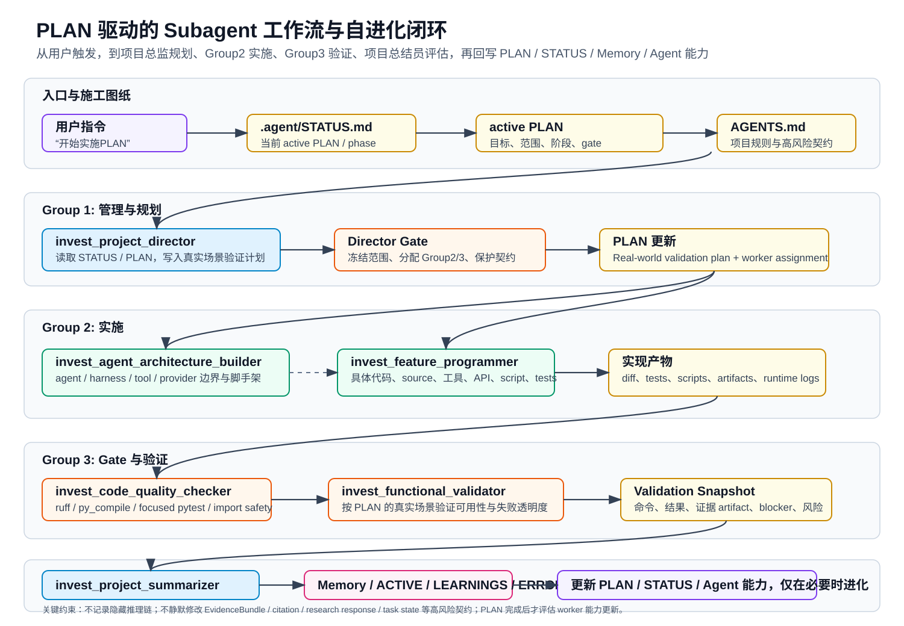

# Agent 工作流与自进化能力报告

生成日期：2026-04-29  
项目：`E:\invest_agent`  
报告范围：当前 v2 六角色 subagent 工作流、PLAN 驱动机制、自进化能力、TDD 与 gate 体系、运行日志和调用关系。



## 1. 执行摘要

当前项目采用 **PLAN 驱动的 v2 六角色 subagent 工作体系**。核心原则是：

```text
PLAN 是严格施工图纸。
```

这意味着项目中的非简单任务不应从临时口头指令直接进入编码，而应从 active PLAN 开始。PLAN 需要记录目标、范围、约束、阶段、真实场景验证计划、Group 2/Group 3 分工、validation snapshot、风险和下一步。

当用户说“开始实施PLAN”“开始实施 PLAN”“实施当前PLAN”“执行PLAN”或等价表达时，项目规则要求自动触发 v2 subagent 工作流，不需要用户额外说“按 v2 subagent 工作流”或显式点名 subagents。

当前工作流的标准链路是：

```text
invest_project_director
  -> 写入/补全 PLAN 的真实场景验证计划
  -> 安排 Group 2 和 Group 3
  -> Group 2 执行架构或代码工作
  -> Group 3 做代码质量检查
  -> Group 3 做真实功能验证
  -> invest_project_summarizer 在 PLAN 完成后总结
  -> 仅在必要时更新 worker 能力
```

自进化能力由三层构成：

1. **项目可见状态层**：`AGENTS.md`、`.agent/STATUS.md`、`.agent/PLANS/*`、`docs/*`、`.codex/agents/*`。
2. **长期记忆层**：`PROFILE.md`、`ACTIVE.md`、`LEARNINGS.md`、`ERRORS.md`、`FEATURE_REQUESTS.md`。
3. **运行证据层**：`data/run_logs/*.jsonl`、`data/tmp/*` eval artifacts、pytest/ruff/compile 结果、PLAN validation snapshot。

项目的自进化不是“自动随意改规则”，而是：当错误、用户纠正、缺失能力、外部工具行为偏差、可复用 workaround 或 PLAN 完成后的系统性能力缺口出现时，才将经验写入 memory、PLAN、STATUS 或 subagent 能力配置。

## 2. 当前项目状态

当前 active PLAN：

```text
.agent/PLANS/source-strong-evidence-adapter-remediation-v1.md
```

当前阶段：

```text
Phase 7 - 12-Case Strong-Evidence Quality Gate
```

当前目标是把 source 系统从“routing/runtime works”推进到“strong evidence coverage 足够进入阶段性 50-query evaluation”。该阶段强调：

- 12-case smoke set 是回归与质量评估工具。
- 后续 50-query pressure set 是压力评估工具。
- 不允许为了单个 query 写过拟合规则。
- 重点评估通用 source-quality 改进。
- 需要保护 EvidenceBundle、EvidenceItem citation、`source_quality_summary`、research response、task/job state、run/run_steps、provider/config compatibility、content/delivery contract 等高风险契约。

当前 subagent 模型成本策略：

| Agent | 默认模型 | 推理强度 |
| --- | --- | --- |
| `invest_project_director` | `gpt-5.4` | `medium` |
| `invest_project_summarizer` | `gpt-5.4` | `medium` |
| `invest_agent_architecture_builder` | `gpt-5.4` | `medium` |
| `invest_feature_programmer` | `gpt-5.3-codex` | `medium` |
| `invest_code_quality_checker` | `gpt-5.3-codex-spark` | `medium` |
| `invest_functional_validator` | `gpt-5.4` | `medium` |

成本策略的关键点：

- 默认不用 `gpt-5.5`。
- 高频短机械检查优先 `gpt-5.3-codex-spark`。
- 具体代码实现保留 `gpt-5.3-codex`。
- 规划、架构判断、实际功能验证使用 `gpt-5.4`。
- 默认推理强度为 `medium`，避免长期 PLAN 执行中 token/cost 膨胀。

## 3. 六角色 Subagent 架构

### 3.1 Group 1：管理层

#### `invest_project_director`

项目总监是每个非简单 PLAN-driven 任务的第一入口。

职责：

- 读取 `AGENTS.md`、`.agent/STATUS.md` 和 active PLAN。
- 理解当前项目进度、当前 phase 和保护契约。
- 在 Group 2 开始前，把真实场景验证计划写入 active PLAN。
- 设计后续任务并分配 Group 2/Group 3。
- 冻结 scope、allowed write set、gate、validation evidence。
- 记录 progress、validation、assumptions、risks、next action。

项目总监的关键产物不是代码，而是可执行施工计划：

```text
task_classification:
active_plan_summary:
real_world_validation_plan:
group2_assignments:
group3_assignments:
phase_gates:
risks:
next_action:
```

#### `invest_project_summarizer`

项目总结员只在 PLAN 完成后进入。

职责：

- 总结 PLAN 做了什么、验证了什么、剩余风险是什么。
- 评估当前 PLAN 对未来工作的影响。
- 检查 Group 2/Group 3 worker 能力是否需要更新。
- 如果不需要更新，明确写出“不需要更新”。
- 推荐下一个 active PLAN 或记录当前没有 active long-running PLAN。

重要边界：

- 不为一次性问题重写 worker 能力。
- 不替代项目总监管理 active phase。
- 不直接修改生产代码。

### 3.2 Group 2：执行层

#### `invest_agent_architecture_builder`

用于 agent / harness engineering 架构任务。

典型职责：

- 设计 agent orchestration。
- 设计 handoff payload。
- 设计 tool/provider abstraction。
- 设计 run trace / execution log。
- 搭建 PLAN-driven validation hooks。
- 将 prompt-only 的隐式逻辑沉淀为 typed contracts、显式接口或文档。

适用场景：

- 新建 agent 编排层。
- 更新 `.codex/agents/*`。
- 设计 eval harness。
- 设计 source-discovery / extraction / evidence-quality 的通用架构。
- 设计可迁移到 MCP-style tools 的接口边界。

#### `invest_feature_programmer`

用于具体功能实现。

典型职责：

- 修改 source retrieval 架构。
- 新增或更新 source/tool adapter。
- 实现 API route、service、script、tests。
- 修复 parser、normalizer、eval script。
- 添加 focused tests。

边界：

- 不做无关重构。
- 不静默修改高风险契约。
- 不削弱 direct structured adapters。
- 不输出直接证券投资建议。

### 3.3 Group 3：验证层

#### `invest_code_quality_checker`

负责机械质量 gate。

检查内容：

- `ruff`
- `py_compile`
- focused `pytest`
- import safety
- touched-file scope review
- `.agent/skills/*` 中对应任务类型的检查

它需要区分：

- 当前改动导致的失败。
- repo 既有无关失败，例如当前已知的 `data/tmp` scratch/demo scripts 导致 repo-wide ruff 失败。

#### `invest_functional_validator`

负责真实功能验证。

它不只看测试是否通过，而要问：

```text
这个功能在 PLAN 描述的真实场景里是否真的可用？
```

验证方式可以包括：

- API 调用。
- eval helper script。
- worker tick。
- live search / extraction artifact。
- runtime log。
- generated JSON/CSV/Markdown artifact。
- 手工检查关键字段。

## 4. 调用关系与数据流

完整调用关系如下：

```text
用户说“开始实施PLAN”
  -> 读取 AGENTS.md / STATUS / active PLAN
  -> invest_project_director
     -> 写入 Real-world validation plan
     -> 冻结 scope / gate / allowed write set
     -> 分配 Group 2 / Group 3
  -> invest_agent_architecture_builder 或 invest_feature_programmer
     -> 产出代码 / 脚手架 / tests / scripts / artifacts
  -> invest_code_quality_checker
     -> ruff / compile / focused pytest / scope check
  -> invest_functional_validator
     -> 按 PLAN 验证真实行为
  -> active PLAN / STATUS
     -> 记录 validation snapshot / risks / next action
  -> invest_project_summarizer
     -> PLAN 完成后总结
     -> 判断是否更新 Group 2/3 能力
  -> Memory / AGENTS / docs / .codex/agents
     -> 仅在必要时进化
```

这条链路解决两个问题：

- **工作不会脱离 PLAN**：所有 worker 都从 PLAN 的当前 phase、allowed write set 和 gate 出发。
- **验证先于实现被设计**：项目总监必须先写入真实场景验证计划，Group 3 后续按该计划执行。

## 5. TDD 在当前项目中的落地方式

这里的 TDD 不是狭义“先写单元测试再写一行代码”，而是更适合当前系统的 **PLAN-driven TDD**：

```text
先定义验收与失败条件
  -> 再实现最小代码
  -> 再跑自动化 gate
  -> 再跑真实场景 validation
  -> 最后回写 PLAN/STATUS
```

### 5.1 TDD 三段式映射

| TDD 阶段 | 当前项目中的落地方式 | 负责人 |
| --- | --- | --- |
| Red | 在 PLAN 中写入 real-world validation plan、acceptance criteria、failure cases；补 focused tests 或 eval fixture | `invest_project_director` + Group 3 设计要求 |
| Green | Group 2 做最小可行实现，让 focused tests 和功能 gate 通过 | `invest_agent_architecture_builder` / `invest_feature_programmer` |
| Refactor | 在不改变契约的前提下收窄重复逻辑、改善结构、补文档和状态 | Group 2，随后 Group 3 验证 |

### 5.2 当前项目的测试分层

当前项目的测试与验证分为六层：

1. **静态质量层**
   - `ruff`
   - import ordering
   - line length
   - Python compatibility

2. **编译/import 层**
   - `python -m py_compile <changed files>`
   - import safety
   - 避免导入级错误中断整个模块加载

3. **focused pytest 层**
   - 只跑与当前改动直接相关的测试。
   - 例如 source 改动跑 source-focused tests。

4. **contract regression 层**
   - source-layer contract check
   - research-contract check
   - task-flow check
   - 避免破坏 EvidenceBundle、citation、research response、task state 等下游契约。

5. **functional validation 层**
   - 按 PLAN 的真实场景验证计划跑脚本/API/live artifact。
   - 不把 unit test pass 等同于功能可用。

6. **artifact/audit 层**
   - 保存 JSON/CSV/Markdown artifacts。
   - 保存 runtime compact logs。
   - 写入 PLAN/STATUS validation snapshot。

### 5.3 Source 任务中的 TDD 示例

以当前 source strong evidence gate 为例，TDD 不应围绕单个 query 过拟合，而应围绕通用质量目标设计：

```text
目标：提高 strong evidence coverage
样本：12-case smoke set，后续 50-query pressure set
Red：识别 company_disclosure / project_list / statistics / environmental_or_land_record 缺口
Green：实现通用 direct structured evidence lanes 或 source-quality 改进
Refactor：保留 direct-keep primary path，避免把 Tavily 变成万能替代
Gate：DeepSeek audit + batch report + artifact comparison
```

关键约束：

- smoke-query 是压力样本，不是定制规则目标。
- 不允许为某一个 query 写过拟合规则。
- 强证据覆盖要提升通用 source routing、discovery、extraction、evidence-quality 能力。

## 6. Gate 体系

当前项目的 gate 体系是为了让每一步都可停止、可回滚、可解释。

### 6.1 Director Gate

进入实现前必须满足：

- active PLAN 已读取。
- 当前 phase 已确认。
- allowed write scope 已冻结。
- 高风险契约已列出。
- real-world validation plan 已写入 PLAN。
- Group 2/Group 3 assignment 已明确。

如果没有 active PLAN，先创建或选择 PLAN。

### 6.2 Architecture Gate

当任务涉及架构、接口、provider、source routing、task 状态或证据结构时触发。

检查重点：

- 是否触碰 EvidenceBundle / citation / research response / task state。
- 是否需要 migration 或兼容策略。
- 是否保持 direct structured source 的 primary path。
- 是否有可审计 trace / artifact / log。
- 是否能后续迁移到 MCP-style tool adapters。

### 6.3 Implementation Gate

Group 2 完成后必须报告：

```text
assigned_scope:
files_changed:
behavior_changed:
validation_run:
validation_result:
blockers:
contract_risks:
next_recommendation:
```

如果实现超出 allowed write scope，需要回到项目总监重新开 gate。

### 6.4 Code Quality Gate

由 `invest_code_quality_checker` 执行。

典型命令：

```powershell
python -m ruff check <changed files>
python -m py_compile <changed files>
pytest -q <focused tests>
```

按任务类型补充：

```powershell
# source_layer / domestic_source_collectors
pytest -q tests/test_sources_layer.py tests/test_sources_adapters_v1.py tests/test_sources_hardening_step34.py tests/test_sources_evals_step35.py

# research_workflow / provider_layer
pytest -q tests/test_agents_workflow.py tests/test_research_api.py tests/test_research_provider_integration.py tests/test_deepseek_provider.py

# task_substrate
pytest -q tests/test_tasks_service.py tests/test_tasks_api.py
```

当前已知例外：

- `python -m ruff check .` 会被既有 `data/tmp` scratch/demo scripts 阻断。
- 这类失败应记录为 pre-existing unrelated failure，而不是误判当前改动失败。

### 6.5 Functional Validation Gate

由 `invest_functional_validator` 执行。

验证内容来自 PLAN 的 `Real-world validation plan`：

```text
Scenario:
Inputs:
Expected behavior:
Acceptance criteria:
Evidence to capture:
Fallback/blocker handling:
```

它必须回答：

- 实际功能是否跑通？
- 输出是否满足 acceptance criteria？
- 失败是否透明？
- 是否生成证据 artifact？
- 是否有外部依赖 blocker？
- 是否需要回到 Group 2？

### 6.6 Completion Gate

PLAN 不能只因为代码写完就完成。

完成条件：

- required checks pass。
- changed files 已做 scope review。
- docs/status/PLAN 已更新。
- validation snapshot 已写入。
- risks/TODOs 已记录。
- 如果有 validation gap，必须明确是 blocker 还是用户接受的 known limitation。

### 6.7 Summary And Capability Update Gate

PLAN 完成后由 `invest_project_summarizer` 判断：

- 是否只是一次性 bug？
- 是否出现重复能力缺口？
- 是否需要更新 `.codex/agents/*.toml`？
- 是否需要更新 `docs/subagents-operating-model.md`？
- 是否需要更新 `AGENTS.md` 规则？
- 是否需要推广 memory 到 `ACTIVE.md`？

原则：

```text
无必要，不更新 worker 能力。
有重复模式或结构性缺口，再更新。
```

## 7. 自进化能力设计

当前自进化能力由 memory、PLAN/STATUS、runtime logs、subagent capability review 组成。

### 7.1 Memory 文件体系

全局 memory 目录：

```text
C:\Users\LEGION\.codex\memories
```

关键文件：

| 文件 | 作用 |
| --- | --- |
| `PROFILE.md` | 用户角色、技术水平、沟通偏好、工作偏好 |
| `ACTIVE.md` | 每次任务都应默认应用的稳定规则 |
| `LEARNINGS.md` | 可复用经验、纠正、最佳实践 |
| `ERRORS.md` | 运行错误、工具异常、debug 记录 |
| `FEATURE_REQUESTS.md` | 用户需要但当前不存在的能力 |

任务开始前必须读取 `PROFILE.md` 和 `ACTIVE.md`。

### 7.2 自动记录触发条件

当以下情况发生时，应自动写 memory，不额外询问：

1. command/tool/operation 非预期失败。
2. 用户纠正事实、日期、假设或项目规则。
3. 用户要求的能力不存在。
4. 外部 API、集成或工具行为与预期不符。
5. 发现可复用 workaround、debug 模式或更好的长期做法。

写入目标：

| 触发内容 | 写入文件 |
| --- | --- |
| 学习、纠正、最佳实践 | `LEARNINGS.md` |
| 运行错误、debug notes | `ERRORS.md` |
| 缺失能力请求 | `FEATURE_REQUESTS.md` |

### 7.3 Promotion 规则

如果某条经验重复出现，或者跨任务稳定有效，应晋升到 `ACTIVE.md`。

如果某条规则成为项目顶层稳定规则，或用户明确要求，应写入项目 `AGENTS.md`。

示例：

- `rg.exe Access is denied` 多次出现后，被提升为 ACTIVE：遇到该问题直接改用 `Get-ChildItem` + `Select-String`。
- 用户要求“开始实施PLAN”自动触发 v2 subagent 工作流后，规则写入 `AGENTS.md`。
- 用户要求默认降低 subagent token/cost 后，模型策略写入 subagent docs 和 config。

### 7.4 项目可见状态层

项目不会依赖隐藏对话记忆保存关键状态，而是写入：

```text
.agent/STATUS.md
.agent/PLANS/*.md
.agent/PLANS/archive/*.md
docs/*.md
AGENTS.md
.codex/agents/*.toml
```

这让后续任意 session 都能恢复项目当前状态。

### 7.5 Runtime Evidence 层

系统已实现 compact runtime logs：

```text
SYSTEM_RUN_LOG_ENABLED=true
SYSTEM_RUN_LOG_DIR=data/run_logs
SYSTEM_RUN_LOG_MAX_VALUE_CHARS=240
SYSTEM_RUN_LOG_MAX_ITEMS=8
```

日志命名：

```text
YYYYMMDDTHHMMSSZ_<task-name>_run-<id>.jsonl
```

日志记录：

- input 摘要
- decision 摘要
- output 摘要
- error 摘要

日志保护：

- 屏蔽 `secret/token/password/api_key/reasoning`。
- 重文本字段保存 `{chars, preview}`。
- 不记录隐藏 chain-of-thought。

### 7.6 Subagent 能力更新闭环

能力更新只能在 PLAN 完成后进入，由 `invest_project_summarizer` 评估。

更新条件：

- Group 2 repeatedly 无法处理某类架构/代码任务。
- Group 3 repeatedly 漏掉某类质量或功能问题。
- 某类 gate 经常因为缺失标准而返工。
- 用户明确要求调整工作体系、模型成本、角色职责。

不更新条件：

- 单次错误。
- 一次性环境故障。
- 临时 API 限流。
- 某个 query 的偶发失败。

## 8. 当前项目中的 TDD + Gate 执行模板

### 8.1 新 phase 开始模板

```text
开始实施PLAN
```

自动触发：

```text
1. invest_project_director 读取 STATUS 和 active PLAN
2. 更新 PLAN 的 Real-world validation plan
3. 分配 Group 2 和 Group 3
4. Group 2 实现
5. Group 3 质量检查
6. Group 3 功能验证
7. PLAN 完成后 summarizer 总结
```

### 8.2 Real-world Validation Plan 模板

```markdown
## Real-world validation plan

Scenario:
- 这个 phase 要证明的真实任务/用户流。

Inputs:
- 具体 query、payload、文件、source URL、task id 或 CLI 命令。

Expected behavior:
- 可观察输出和系统状态。

Acceptance criteria:
- 明确 pass/fail 标准。

Validation owner:
- invest_code_quality_checker / invest_functional_validator。

Evidence to capture:
- logs、JSON 字段、artifact、run id、task id、截图等。

Fallback/blocker handling:
- 外部依赖缺失或环境能力不足时如何记录。
```

### 8.3 Worker Assignment 模板

```markdown
Group 2 Assignments:
- invest_agent_architecture_builder:
  - ownership:
  - expected output:
- invest_feature_programmer:
  - ownership:
  - expected output:

Group 3 Validation:
- invest_code_quality_checker:
  - commands:
  - pass criteria:
- invest_functional_validator:
  - scenario:
  - evidence:
```

### 8.4 Validation Snapshot 模板

```markdown
## Validation snapshot

Code quality:
- command -> result

Focused tests:
- command -> result

Functional validation:
- artifact:
- observed behavior:
- acceptance:

Known limitations:
- ...

Next action:
- ...
```

## 9. 当前 active PLAN 的执行含义

当前 active PLAN 是 `source-strong-evidence-adapter-remediation-v1.md`，Phase 7 是 12-case strong-evidence quality gate。

在这个阶段，正确执行方式是：

1. 项目总监确认 Phase 7 的评估目标不是单 query 过拟合。
2. Group 2 只在 PLAN 允许范围内准备 audit/batch/report 所需脚本或 artifact。
3. Group 3 跑 DeepSeek audit、batch report、quality gate。
4. functional validator 评估：
   - 12-case 是否有 blocker。
   - strong evidence coverage 是否改善。
   - failure transparency 是否足够。
   - 是否可以进入 50-query staged evaluation。
5. summarizer 在 PLAN 完成后判断：
   - 是否需要增强 Group 2 的 source evidence 能力。
   - 是否需要增强 Group 3 的 source-quality validation 能力。
   - 是否需要更新 subagent role docs 或 model policy。

## 10. 风险与控制

### 10.1 过拟合风险

风险：

- 针对 12-case 或 50-query 中某个 query 写特殊规则。

控制：

- 把 query 当作压力样本。
- 只接受能提升通用 routing/discovery/extraction/evidence-quality 的改动。
- 在 PLAN 中明确记录“禁止 one-query overfitting”。

### 10.2 契约破坏风险

风险：

- 修改 EvidenceBundle、citation、research response、task state 后破坏 downstream。

控制：

- 高风险契约必须 PLAN 明确授权。
- 必须记录 migration/compatibility impact。
- 必须跑对应 contract regression。

### 10.3 日志膨胀与敏感信息风险

风险：

- runtime logs 重复写入大段正文或泄露 key/token/reasoning。

控制：

- sensitive keys redaction。
- heavy text `{chars, preview}`。
- 不记录 hidden reasoning chain。

### 10.4 自进化失控风险

风险：

- 每遇到一次小问题就改 AGENTS 或 subagent 能力，导致工作体系不稳定。

控制：

- 一次性问题只写 `LEARNINGS.md` 或 `ERRORS.md`。
- 重复模式才进入 `ACTIVE.md`。
- 顶层稳定规则或用户明确要求才进入 `AGENTS.md`。
- PLAN 完成后才由 summarizer 评估 worker 能力更新。

## 11. 文件索引

核心规则：

- `AGENTS.md`
- `.agent/STATUS.md`
- `.agent/PLANS/*.md`
- `.agent/PLANS/archive/*.md`

Subagent 配置：

- `.codex/agents/invest_project_director.toml`
- `.codex/agents/invest_project_summarizer.toml`
- `.codex/agents/invest_agent_architecture_builder.toml`
- `.codex/agents/invest_feature_programmer.toml`
- `.codex/agents/invest_code_quality_checker.toml`
- `.codex/agents/invest_functional_validator.toml`

Subagent 文档：

- `docs/subagents-operating-model.md`
- `docs/current-subagents-overview.md`

项目说明：

- `docs/current-project-overview.md`

运行日志：

- `packages/core/run_log.py`
- `data/run_logs/*.jsonl`

本报告：

- `docs/agent-workflow-self-evolution-report.md`
- `docs/agent-workflow-self-evolution-report.pdf`
- `docs/assets/agent-workflow-self-evolution-call-graph.svg`

## 12. 结论

当前项目的工作体系已经从“临时调用 agent”演进为“PLAN 驱动的工程执行系统”。

它的关键特征是：

- PLAN 是施工图纸。
- 项目总监先定义真实场景验证。
- Group 2 负责架构与代码实施。
- Group 3 负责质量 gate 与真实功能验证。
- 项目总结员只在 PLAN 完成后评估是否需要更新能力。
- TDD 通过 PLAN 中的 acceptance criteria、focused tests、functional validation 和 artifact snapshot 落地。
- 自进化通过 memory、STATUS、PLAN、runtime logs 和 completed-PLAN summarization 闭环实现。

这套机制的目标不是让 agent “更多”，而是让每次执行都更可追踪、更可验证、更不容易破坏核心契约。
