# Review-Gated Agent Workflow

Status: draft
Audience: Codex users, plugin authors, workflow maintainers
Scope: universal workflow specification

## Purpose

This workflow turns product-level work into a controlled, review-gated path:

1. explicitly enter PRD workflow;
2. brainstorm the requirement;
3. generate a reviewable HTML PRD/RPD;
4. stop for human PRD review;
5. create a PLAN only after approval;
6. stop for human PLAN review;
7. execute the PLAN only after explicit implementation instruction;
8. separate implementation from code-quality and functional validation;
9. summarize the completed PLAN and decide whether the workflow needs updates.

The workflow is universal by default. It must not assume any specific project,
domain, architecture, programming language, or business model. Project-specific
worker design happens only inside the explicit `group2-design` process.

## Core Terms

`PRD workflow`
: The explicit pre-PLAN process that turns a user feature idea into a reviewed
  PRD/RPD and then into a reviewed PLAN.

`RPD`
: Reviewable PRD Document. It is the human-review version of the PRD, commonly
  generated as HTML with diagrams, acceptance tables, risk matrices, and open
  questions.

`Gate`
: A human or governance checkpoint before the next workflow stage. Gates happen
  before PLAN execution and do not use phase status icons.

`Phase`
: A PLAN execution stage after the user explicitly starts or continues the PLAN.
  Phase status icons are used only here.

`group2-design`
: A multi-round, human-guided design process for adapting the universal Group2
  implementation roles to a specific project.

## Invocation Policy

The PRD workflow is explicit-only. Codex must not infer it from ordinary
development work.

Valid explicit triggers:

```text
$prd-workflow
开始设计 PRD：<feature>
为 <feature> 启动 PRD 评审工作流
进入 review-gated PRD workflow
使用 PRD workflow 规划这个功能
```

Valid explicit `group2-design` triggers:

```text
$group2-design
为这个项目设计 Group2
更新这个项目的 Group2 worker 设计
为当前 PLAN 显式启动 group2-design
```

Non-triggers:

```text
帮我修这个 bug
解释这个模块
继续执行 PLAN
跑一下测试
帮我 review 这个 diff
添加一个小工具函数
更新 README 的一句话
根据当前 PLAN 继续任务
```

If the user asks for ordinary coding, testing, review, or explanation, use the
normal Codex workflow. Do not force a PRD stage unless the user explicitly asks
for PRD workflow or the repository's active PLAN already requires it.

## Gate Sequence

Pre-PLAN work uses gates, not phases:

```text
Gate A: PRD entry confirmation
Gate B: universal brainstorm
Gate C: HTML PRD/RPD generation
Gate D: human PRD review
Gate E: optional explicit group2-design
Gate F: plan-creator creates PLAN
Gate G: human PLAN review
Gate H: wait for explicit implementation command
```

Gate behavior:

| Gate | Owner | Output | Must stop for human? |
|---|---|---|---|
| Gate A | Main agent | confirmed feature frame | only if required inputs are missing |
| Gate B | brainstorm skill | requirement frame, risks, alternatives | no, unless critical unknowns block PRD |
| Gate C | PRD/RPD builder | HTML PRD/RPD and review notes | yes |
| Gate D | Human | approval, rejection, or edits | yes |
| Gate E | Human + group2-design | project-bound Group2 design | yes, when invoked |
| Gate F | plan-creator | PLAN file | no |
| Gate G | Human | PLAN approval or edits | yes |
| Gate H | Human | explicit implementation instruction | yes |

The workflow must not create a PLAN before PRD approval. It must not execute a
PLAN before PLAN approval.

## PLAN Phase Display

Phase status display appears only after the user explicitly starts or continues
the approved PLAN.

Use this format:

```text
phase 1✅：workflow-director 已完成 PLAN 分析、验证设计和任务分配
phase 2⏳：Group2 正在执行 scoped implementation
phase 3：Group3 尚未开始验证
phase 4：workflow-summarizer 尚未开始总结
```

Recommended symbols:

| Symbol | Meaning |
|---|---|
| `✅` | phase completed and required validation passed |
| `⏳` | phase in progress |
| `⚠️` | phase blocked or needs remediation |
| `❌` | phase failed and cannot continue safely |
| no symbol | phase not started |

Do not use these phase symbols for PRD gates. Gates should be described as
review checkpoints, not as execution phases.

## Universal Roles

Universal names are used in the open-source workflow. Project-specific names may
be generated later by `group2-design`, but the base workflow remains generic.

| Group | Role | Responsibility |
|---|---|---|
| Group1 | `workflow-director` | Reads the approved PLAN, refines validation, assigns work, controls phase transitions. |
| Group1 | `workflow-summarizer` | Runs after done condition, evaluates outcome and whether roles, skills, or hooks need updates. |
| Group2 | `architecture-builder` | Designs architecture, boundaries, contracts, harnesses, migration plans, and scope controls. |
| Group2 | `feature-implementer` | Implements concrete code, tools, scripts, APIs, docs, or templates inside assigned scope. |
| Group3 | `code-quality-validator` | Runs lint, format, compile, tests, import checks, and diff-scope review. |
| Group3 | `functional-validator` | Validates practical behavior against PLAN acceptance criteria and realistic cases. |

## Group2 Design Protocol

`group2-design` is explicit-only and interactive. It must not be completed in a
single automatic pass.

Required rounds:

| Round | Goal | Human participation |
|---|---|---|
| 1 | Project discovery: domain, stack, architecture, existing conventions, risk boundaries | Human confirms or corrects project facts |
| 2 | Role proposal: candidate Group2 workers, responsibilities, non-goals | Human accepts, rejects, merges, or splits roles |
| 3 | Scope boundaries: allowed writes, forbidden paths/contracts, sandbox posture | Human confirms acceptable risk |
| 4 | Validation handoff: Group3 checks, TDD policy, live eval expectations, artifacts | Human confirms validation expectations |
| 5 | Final review: freeze project-bound Group2 design | Human explicitly approves |

`group2-design` may produce project-bound roles, but it should also keep a
mapping back to universal roles:

```text
universal architecture-builder -> project-specific <role name>
universal feature-implementer -> project-specific <role name>
```

## Scope Boundaries

Default scope rules:

| Stage | May write | Must not write |
|---|---|---|
| Brainstorm | PRD draft notes | production code, PLAN, STATUS, agent config |
| PRD/RPD builder | PRD/RPD docs and assets | production code, PLAN, STATUS |
| plan-from-prd | PLAN and STATUS handoff | production code |
| group2-design | group design docs/templates after approval | production code, active PLAN unless assigned |
| Group2 implementation | assigned code/test/docs paths | PLAN/STATUS, unrelated modules, forbidden contracts |
| Group3 validation | validation reports/artifacts | production logic unless reassigned |
| workflow-summarizer | PLAN/STATUS/archive summary | production code |

Hooks should enforce scope through:

1. preflight checks before tools or writes;
2. postflight diff audits after tool use;
3. stop-gate checks before Codex claims completion.

Hooks must not reinterpret ordinary user requests as PRD workflow triggers.

## Full Workflow Diagram

```mermaid
flowchart TD
    A[User request] --> B{Explicit PRD workflow invocation?}

    B -- No --> C[Normal Codex workflow]
    C --> C1[Read repo rules and active PLAN only when required]
    C1 --> C2[Execute docs/code/test/review task]
    C2 --> C3[Update PLAN/STATUS only when project rules require it]
    C3 --> Z1[End]

    B -- Yes --> D[Gate A: PRD entry confirmation]
    D --> D1[Confirm feature name, background, users, goals, non-goals]
    D1 --> E[Gate B: universal brainstorm]

    E --> E1[Problem framing]
    E --> E2[Solution candidates]
    E --> E3[Risks, boundaries, open questions]
    E1 --> F[Gate C: HTML PRD/RPD generation]
    E2 --> F
    E3 --> F

    F --> F1[Apply PRD template]
    F1 --> F2[Generate flow chart, risk matrix, acceptance table]
    F2 --> F3[Write reviewable PRD/RPD artifact]

    F3 --> G[Gate D: human PRD review]
    G --> H{Approved?}
    H -- No --> H1[Human feedback]
    H1 --> E

    H -- Yes --> I{Explicit need for group2-design?}
    I -- No --> L[Gate F: create PLAN from approved PRD]
    I -- Yes --> J[Gate E: group2-design multi-round dialogue]

    J --> J1[Round 1 project discovery]
    J1 --> J2[Round 2 role proposal]
    J2 --> J3[Round 3 scope and permission boundaries]
    J3 --> J4[Round 4 validation handoff]
    J4 --> K[Human review of Group2 design]
    K --> K1{Approved?}
    K1 -- No --> J1
    K1 -- Yes --> L

    L --> L1[Extract scope, risks, acceptance, validation]
    L1 --> L2[Create PLAN]
    L2 --> M[Gate G: human PLAN review]
    M --> N{Approved?}
    N -- No --> N1[Human PLAN feedback]
    N1 --> L

    N -- Yes --> O[Gate H: wait for explicit implementation command]
    O --> P{User says start or continue PLAN?}
    P -- No --> Z2[Stop at approved PLAN]
    P -- Yes --> Q[PLAN execution begins]

    Q --> R[phase 1: workflow-director]
    R --> R1[phase 1 status]
    R1 --> S[phase 2: Group2 scoped implementation]
    S --> S1[architecture-builder if architecture gate is needed]
    S --> S2[feature-implementer for concrete implementation]
    S1 --> S3[phase 2 status]
    S2 --> S3

    S3 --> T[phase 3: Group3 validation]
    T --> T1[code-quality-validator]
    T --> T2[functional-validator]
    T1 --> T3[phase 3 status]
    T2 --> T3

    T3 --> U{Validation passed?}
    U -- No --> V[Director remediation gate]
    V --> S
    U -- Yes --> W[phase 4: workflow-summarizer]
    W --> W1[Outcome, risks, TODOs]
    W1 --> W2[Decide whether roles, skills, or hooks need update]
    W2 --> X[Update PLAN/STATUS and archive when done]
    X --> Z3[End]
```



## Manual Governance Dry Run

Use these prompts to verify trigger behavior:

| Prompt | Expected route |
|---|---|
| `$prd-workflow 为导入 CSV 功能生成 PRD` | Enter PRD workflow |
| `开始设计 PRD：团队任务看板` | Enter PRD workflow |
| `为这个项目设计 Group2` | Enter group2-design |
| `帮我修复导入 CSV 的编码 bug` | Normal Codex workflow |
| `继续执行 PLAN` | PLAN execution router, not PRD workflow |
| `解释 packages/foo/service.py` | Normal Codex explanation |
| `跑一下测试` | Normal Codex testing |
| `帮我 review 这个 diff` | Normal Codex review |

Acceptance:

- PRD workflow triggers only on explicit PRD workflow language.
- `group2-design` triggers only on explicit group design language.
- Ordinary implementation, review, test, and explanation requests do not enter
  PRD workflow.

## Stop Conditions

Stop and ask for human input when:

- PRD review is required;
- PLAN review is required;
- group2-design reaches a review round;
- project facts are missing and cannot be inferred safely;
- a protected contract would need to change;
- validation fails without a safe repair path;
- user explicitly pauses or changes the goal.

Routine phase completion during PLAN execution should not stop by default when
the PLAN continue rule permits moving forward.
