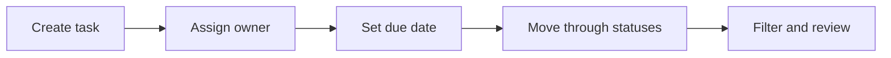

# RPD: Team Task Board

Status: review draft

## 1. Document Info

| Field | Value |
|---|---|
| Name | RPD: Team Task Board |
| Version | v0.1 |
| Status | Review draft |
| Review gate | Human PRD review required before PLAN creation |

## 2. Background And Problem

Small teams need a shared task board to track assignments, status, and due
dates. Current ad hoc tracking in chats or spreadsheets makes ownership and
deadline visibility inconsistent.

Core problem:

> Users need a simple task board that makes ownership, status, and due dates
> visible without requiring a full project-management suite.

## 3. Goals

1. Create tasks with title, description, assignee, status, and due date.
2. Filter tasks by assignee, status, and due date.
3. Update task status through a predictable workflow.
4. Show enough audit information to understand who changed what.

## 4. Non-Goals

1. Do not implement full agile sprint planning.
2. Do not implement billing, time tracking, or workload forecasting.
3. Do not replace a dedicated project-management platform.
4. Do not add AI prioritization in this version.

## 5. User Roles

| Role | Need |
|---|---|
| Team member | See assigned tasks and update status. |
| Team lead | See team workload and overdue tasks. |
| Admin | Configure allowed statuses. |

## 6. Core Flow



## 7. Functional Requirements

| Module | Feature | Priority | Input | Output | Acceptance |
|---|---|---|---|---|---|
| Task | Create task | P0 | title, assignee, due date | task record | Required fields are validated. |
| Task | Change status | P0 | task id, status | updated task | Invalid transitions are rejected. |
| Board | Filter tasks | P0 | assignee/status/date filters | task list | Filters combine predictably. |
| Audit | Change history | P1 | task change events | audit trail | Status and assignee changes are visible. |

## 8. Input / Output

Input example:

```json
{
  "title": "Prepare launch checklist",
  "assignee": "alex@example.com",
  "due_date": "2026-07-15"
}
```

Output example:

```json
{
  "id": "task_123",
  "title": "Prepare launch checklist",
  "assignee": "alex@example.com",
  "status": "todo",
  "due_date": "2026-07-15"
}
```

## 9. Acceptance Cases

| Case | Input | Expected |
|---|---|---|
| TC-001 | Create task with all required fields | Task is created in `todo`. |
| TC-002 | Create task without title | Request is rejected with field error. |
| TC-003 | Filter by assignee and overdue | Only matching overdue tasks are returned. |
| TC-004 | Move `done` task back to `todo` when policy forbids it | Request is rejected. |

## 10. Risks

| Risk | Mitigation |
|---|---|
| Status workflow differs by team | Make allowed statuses configurable. |
| Filters become slow as tasks grow | Add indexed query requirements in PLAN. |
| Audit trail scope expands | Keep P1 audit minimal in first release. |

## 11. Human Review Questions

1. Are custom statuses required in v0.1?
2. Should due-date filtering include timezone-specific behavior?
3. Is audit history P0 or P1?
