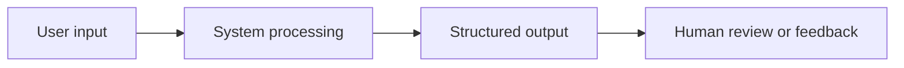

# RPD: {Feature Name}

Status: review_draft

## 1. Document Info

| Field | Value |
|---|---|
| Name | RPD: {Feature Name} |
| Project | {Project Name} |
| Version | v0.1 |
| Status | Review draft |
| Review gate | Human PRD review required before PLAN creation |

## 2. Background And Problem

{Describe the user problem in concrete terms.}

Core problem:

> {One sentence problem statement.}

## 3. Goals

1. {Goal 1}
2. {Goal 2}
3. {Goal 3}

## 4. Non-Goals

1. {Non-goal 1}
2. {Non-goal 2}
3. {Non-goal 3}

## 5. User Roles

| Role | Need | Frequency |
|---|---|---|
| {Role} | {Need} | {High/Medium/Low} |

## 6. Core Flow



## 7. Functional Requirements

| Module | Feature | Priority | Input | Output | Acceptance |
|---|---|---|---|---|---|
| {Module} | {Feature} | P0 | {Input} | {Output} | {Acceptance} |

## 8. Input / Output

Input example:

```json
{
  "field": "value"
}
```

Output example:

```json
{
  "field": "value"
}
```

## 9. Acceptance Cases

| Case | Input | Expected | Pass Criteria |
|---|---|---|---|
| TC-001 | {Input} | {Expected} | {Criteria} |

## 10. Risks

| Risk | Impact | Mitigation |
|---|---|---|
| {Risk} | {Impact} | {Mitigation} |

## 11. Human Review Questions

1. {Question 1}
2. {Question 2}
3. {Question 3}
